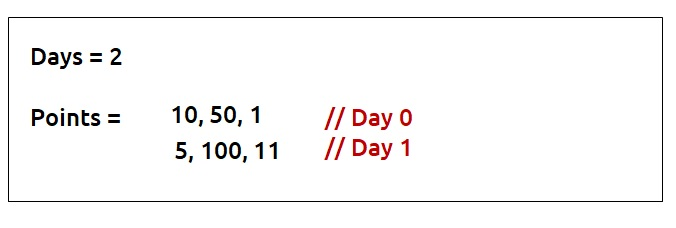

# DP Basics ->

**Key Points:**
1. **Dynamic Programming Introduction:**
   - Definition: Storing answers to sub-problems for efficient solving of the main problem.
   - Two approaches: Memoization and Tabulation.

2. **Memoization (Top-Down):**
   - Recursive solution with overlapping sub-problems.
   - Steps:
      - Create dp array.
      - Check if the answer is already calculated (dp[n] != -1).
      - If not, calculate and store in dp array.
   - Time Complexity: O(N), Space Complexity: O(N).

3. **Tabulation (Bottom-Up):**
   - Iterative approach starting from base cases.
   - Steps:
      - Declare dp array.
      - Initialize base conditions.
      - Iterate to calculate dp[i] using dp[i-1] and dp[i-2].
   - Time Complexity: O(N), Space Complexity: O(N).

4. **Space Optimization:**
   - Utilize only the last two values (prev and prev2) instead of maintaining an entire array.
   - Time Complexity: O(N), Space Complexity: O(1).

**Code Examples:**
1. **Memoization:**
   ```cpp
   int f(int n, vector<int>& dp){
       if(n<=1) return n;
       if(dp[n]!= -1) return dp[n];
       return dp[n] = f(n-1, dp) + f(n-2, dp);
   }
   ```

2. **Tabulation:**
   ```cpp
   vector<int> dp(n+1, -1);
   dp[0] = 0;
   dp[1] = 1;
   for(int i=2; i<=n; i++)
       dp[i] = dp[i-1] + dp[i-2];
   ```

3. **Space Optimization:**
   ```cpp
   int prev2 = 0;
   int prev = 1;
   for(int i=2; i<=n; i++){
       int cur_i = prev2 + prev;
       prev2 = prev;
       prev = cur_i;
   }
   ```

# [70. Climbing Stairs](https://leetcode.com/problems/climbing-stairs/description/)

## Approaches ->
This q is v similar to fibonacci.

## Codes ->
1. Recursion
```cpp
class Solution {
public:
    int fibo(int n, vector<int> &dp){
        // Base Case:
        // when we go to the 0th stair we should return 1 
        //When there are 0 stairs (n=0), there is only one way to climb them, 
        //which is to not climb at all. Returning 1 in this case signifies that there is one way to climb 0 stairs.
        // We will go to 0th stair when we move 1 step i.e. only one way to go to 0
        if(n==0 || n==1) return 1;

        if(dp[n]!=-1) return dp[n];

        return dp[n] = fibo(n-1, dp) + fibo(n-2, dp);

    }
    int climbStairs(int n) {
        vector<int> dp(n+1,-1);
        return fibo(n, dp);
    }
};
```

2. Tabulation
```cpp
class Solution {
public:
    int climbStairs(int n) {
        vector<int> dp(n+1,-1);

        dp[1] = 1;
        dp[2] = 2;

        for(int i=3; i<n+1; i++){
            dp[i] = dp[i-1] + dp[i-2];
        }

        return dp[n];
    }
};
```

3. Space Optimization ---> In space optimization we will just replace dp[i] with curr, dp[i-1] with prev1 and dp[i-2] with prev2. And at the end we will shift the prevs by 1 position i.e. make prev2 = prev1 and make prev1 = curr.
And at the end just return the curr i.e. prev1
```cpp
class Solution {
public:
    int climbStairs(int n) {
        int prev1 = 2;
        int prev2 = 1;

        for(int i=3; i<n+1; i++){
            int curr = prev1+prev2;

            prev2 = prev1;
            prev1 = curr;
        }

        return prev1;
    }
};
```

# [Frog Jump](https://www.codingninjas.com/studio/problems/frog-jump_3621012?utm_source=striver&utm_medium=website&utm_campaign=a_zcoursetuf&leftPanelTabValue=PROBLEM)

## Approach ->
In this question, we cannot apply greedy. Take an example -> 30, 10, 60, 10, 60, 50. ATQ we can move either 1 or 2 steps. So if we go greedily we will go from 30 to 10 to 10 to 50 === 20 + 0 + 40 = 60 height. But the best way to go would be 30 to 60 to 60 to 50 === 30 + 0 + 10 = 40 height. So we will use recursion

## Code ->
1. Recursion (Top-Down ---> We went from n to 0 (or 0 to n doesn't matter) but we are going from top of the tree to the base condition i.e. down)
```cpp
#include <bits/stdc++.h> 
int helper(int ind, vector<int> &heights, vector<int> &dp){
    if(ind==0) return 0;
    
    if(dp[ind]!=-1) return dp[ind];

    int left = helper(ind-1, heights, dp) + abs(heights[ind]-heights[ind-1]);
    int right = INT_MAX;
    if(ind>1) right = helper(ind-2, heights, dp) + abs(heights[ind]-heights[ind-2]);

    return dp[ind] = min(left, right);
}
int frogJump(int n, vector<int> &heights)
{
    vector<int> dp(n+1, -1);
    return helper(n-1, heights, dp);
}
```
Time Complexity: O(N)
Space Complexity: O(N)

2. Tabulation (Bottom-Up ---> We are going from the base condition to the top i.e. the bottom up approach)
```cpp

int frogJump(int n, vector<int> &heights)
{
    vector<int> dp(n, -1);
    // return helper(n-1, heights, dp);
    dp[0] = 0;

    for(int i=1; i<n; i++){
        int left = dp[i-1] + abs(heights[i] - heights[i-1]);
        int right = INT_MAX;
        if(i>1) right = dp[i-2] + abs(heights[i] - heights[i-2]);

        dp[i] = min(left, right);
    }

    return dp[n-1];
}
```
Time Complexity: O(N)
Space Complexity: O(N)

If there is every something like an index-1 and index-2 in a tabulation, there will always be a possible space optimization
3. Space Optimization
```cpp

int frogJump(int n, vector<int> &heights)
{
    int prev1 = 0;
    int prev2 = 0;

    for(int i=1; i<n; i++){
        int left = prev1 + abs(heights[i] - heights[i-1]);
        int right = INT_MAX;
        if(i>1) right = prev2 + abs(heights[i] - heights[i-2]);

        int curr = min(left, right);

        prev2 = prev1;
        prev1 = curr;
    }

    return prev1;
}
```
Time Complexity: O(N)
Space Complexity: O(1)

# [Minimal Cost](https://www.codingninjas.com/studio/problems/minimal-cost_8180930?utm_source=striver&utm_medium=website&utm_campaign=a_zcoursetuf&leftPanelTabValue=PROBLEM)
This question is exactly same as last question but in the last q we could have moved 2 steps, in this question we can move k steps

## Codes
1. 
```cpp

#include <bits/stdc++.h>
using namespace std;
// Function to find the minimum cost to reach the end using at most 'k' jumps
int solveUtil(int ind, vector<int>& height, vector<int>& dp, int k) {
    // Base case: If we are at the beginning (index 0), no cost is needed.
    if (ind == 0) return 0;
    
    // If the result for this index has been previously calculated, return it.
    if (dp[ind] != -1) return dp[ind];
    
    int mmSteps = INT_MAX;
    
    // Loop to try all possible jumps from '1' to 'k'
    for (int j = 1; j <= k; j++) {
        // Ensure that we do not jump beyond the beginning of the array
        if (ind - j >= 0) {
            // Calculate the cost for this jump and update mmSteps with the minimum cost
            int jump = solveUtil(ind - j, height, dp, k) + abs(height[ind] - height[ind - j]);
            mmSteps = min(jump, mmSteps);
        }
    }
    
    // Store the minimum cost for this index in the dp array and return it.
    return dp[ind] = mmSteps;
}
int minimizeCost(int n, int k, vector<int> &height){
    // Write your code here.
    vector<int> dp(n, -1); // Initialize a memoization array to store calculated results
    return solveUtil(n - 1, height, dp, k); // Start the recursion from the last index
}
```

2. 

```cpp
int minimizeCost(int n, int k, vector<int> &height){
    // Write your code here.
    vector<int> dp(n, -1);
    dp[0] = 0;

    // Loop through the array to fill in the dp array
    for (int i = 1; i < n; i++) {
        int mmSteps = INT_MAX;

        // Loop to try all possible jumps from '1' to 'k'
        for (int j = 1; j <= k; j++) {
            if (i - j >= 0) {
                int jump = dp[i - j] + abs(height[i] - height[i - j]);
                mmSteps = min(jump, mmSteps);
            }
        }
        dp[i] = mmSteps;
    }
    return dp[n - 1]; // The result is stored in the last element of dp
}
```

# [198. House Robber](https://leetcode.com/problems/house-robber/description/)

## Codes->
1. 
```cpp
class Solution {
public:
    int helper(vector<int> &nums, int n, vector<int> &dp){
        if(n<0) return 0;
        if(n==0) return nums[0];

        if(dp[n]!=-1) return dp[n];

        int pick = nums[n] + helper(nums, n-2, dp);
        int notPick = 0 + helper(nums, n-1, dp);

        return dp[n] = max(pick, notPick);
    }
    int rob(vector<int>& nums) {
        int n = nums.size()-1;
        vector<int> dp(n+1, -1);

        return helper(nums, n, dp);
    }
};
```

2. 
```cpp
class Solution {
public:
    int rob(vector<int>& nums) {
        int n = nums.size();
        vector<int> dp(n+1, -1);

        dp[0] = nums[0];

        for(int i=1; i<n; i++){
            int pick = nums[i];
            if(i>1) pick = nums[i] + dp[i-2];
            int notPick = 0 + dp[i-1];

            dp[i] = max(pick, notPick);
        }

        return dp[n-1];
    }
};
```

3. 
```cpp
class Solution {
public:
    int rob(vector<int>& nums) {
        int n = nums.size();

        int prev1 = nums[0];
        int prev2 = 0;

        for(int i=1; i<n; i++){
            int pick = nums[i];
            if(i>1) pick = nums[i] + prev2;
            int notPick = 0 + prev1;

            int curr = max(pick, notPick);

            prev2 = prev1;
            prev1 = curr;
        }

        return prev1;
    }
};
```

# [213. House Robber II](https://leetcode.com/problems/house-robber-ii/description/)

## Approach ->
The only difference in this q from the last one is that the array is circular. That tells us that we can either include the last index elem or the first index elem in our answer. So basically make two temp vectors by removing first and the last elements from nums and pass it in our function. Then return the max result.

## Code ->
```cpp
class Solution {
public:
    int helper(vector<int>& nums){
        int n = nums.size();
        int prev1 = nums[0];
        int prev2 = 0;

        for(int i=1; i<n; i++){
            int pick = nums[i];
            if(i>1) pick = nums[i] + prev2;
            int notPick = 0 + prev1;

            int curr = max(pick, notPick);

            prev2 = prev1;
            prev1 = curr;
        }

        return prev1;
    }
    int rob(vector<int>& nums) {
        // Don't forget to mention this base condition during interview
        // These are the small things that an interviewer looks for
        if(nums.size()==1) return nums[0];
        vector<int> temp1, temp2;
        for(int i=0; i<nums.size(); i++){
            if(i!=0) temp1.push_back(nums[i]);
            if(i!=nums.size()-1) temp2.push_back(nums[i]);
        }

        return max(helper(temp1), helper(temp2));
        
    }
};
```

# [Ninja’s Training](https://www.codingninjas.com/studio/problems/ninja%E2%80%99s-training_3621003?utm_source=striver&utm_medium=website&utm_campaign=a_zcoursetuf&leftPanelTabValue=PROBLEM)

## Approach ->
Now we have stepped our foot in the relms of 2D/3D DP and DP on Grids problems. 
The problem involves finding the maximum merit points a ninja can earn over 'N' days, where each day offers three activities with associated merit points.
The constraint is that the same activity cannot be performed on two consecutive days.

For example ->



If we pick 50 on day 1 then we cannot pick 100 on day 2 because these are the same activites. So we will pick 10 on day 1 and 100 on day 2. Ans - 110.

Recursive Approach:

Express the Problem in Terms of Indexes:

Define a recursive function with parameters 'day' and 'last,' where day represents the row and last represents the column i.e. the particular activity we should avoid the next day. 

Try Out All Possible Choices at a Given Index:

For each day, consider all three activities, excluding the activity performed on the previous day.
Recursively call the function for the next day with the chosen activity.

Take the Maximum of All Choices:

Return the maximum merit points among all the choices for the current day.

Then apply memoisation, tabulation and space optimization as you go...

## Codes
1. 
```cpp
#include <bits/stdc++.h>

int helper(int day, int last, vector<vector<int>> &points, vector<vector<int>> &dp){
   // Base case: if it's the first day, return the maximum merit point for any activity
    if (day == 0) {
        int maxi = 0;
        for (int i = 0; i < 3; i++) {
            if (last != i)
                maxi = max(maxi, points[day][i]);
        }
        return maxi;
    }

    // Check if the result for the current day and last activity is already calculated
    if (dp[day][last] != -1) return dp[day][last];

    int maxi = 0;
    // Iterate over activities for the current day
    for (int i = 0; i < 3; i++) {
        // Ensure the same activity is not performed on two consecutive days
        if (last != i) {
            // Calculate the merit points for the current day and update the maximum
            int point = points[day][i] + helper(day - 1, i, points, dp);
            maxi = max(maxi, point);
        }     
    }

    // Memoize the result by storing it in the dp array
    return dp[day][last] = maxi;
} 


int ninjaTraining(int n, vector<vector<int>> &points)
{
    // Write your code here.
    vector<vector<int>> dp(n, vector<int>(4, -1));
    // Notice how we passed 3 insead of -1 at the place of last
    // This is because dp is checking for dp[day][last] and if we..
    // pass -1 then segmentation fault will occur.
    return helper(n-1, 3, points, dp);
}
```
Time Complexity: O(N*4*3)
Space Complexity: O(N) + O(N*4)

2. 
```cpp
#include <bits/stdc++.h>

int ninjaTraining(int n, vector<vector<int>> &points)
{
    // Initialize a 2D dp array with dimensions (n x 4) for dynamic programming
    // dp[i][j] represents the maximum merit points up to day 'i' with the last activity as 'j'
    vector<vector<int>> dp(n, vector<int>(4, -1));

    // Initialize base cases for the first day (day 0)
    // Preparing the initial values of dp table,
    // before the main dp loop, where we consider subsequent days.
    dp[0][0] = max(points[0][1], points[0][2]);
    dp[0][1] = max(points[0][0], points[0][2]);
    dp[0][2] = max(points[0][0], points[0][1]);
    dp[0][3] = max(points[0][0], max(points[0][1], points[0][2]));

    // Iterate over the days, starting from day 1
    for(int day = 1; day < n; day++) {
        // Notice how 'last' is iterated up to 4 to match the size of the dp array
        for(int last = 0; last < 4; last++) {
            // Initialize the merit points for the current day and last activity
            dp[day][last] = 0;
            
            // Iterate over the possible activities for the current day
            for(int i = 0; i < 3; i++) {
                // Avoid choosing the same activity as the last day
                if(last != i) {
                    // Calculate the merit points for the current day and update dp array
                    int point = points[day][i] + dp[day-1][i];
                    dp[day][last] = max(dp[day][last], point);
                }
            }
        }
    }

    // Return the maximum merit points for the last day with any activity
    return dp[n-1][3];
}
```
Time Complexity: O(N*4*3)

Reason: There are three nested loops

Space Complexity: O(N*4)

We have eleminated the recursion stack space from the SC

3. 
The space optimization technique in this dynamic programming solution involves only keeping track of the information needed for the current day and the previous day, instead of storing the entire 2D array.

### Algorithm / Intuition:

1. **Original Dynamic Programming Equation:**
   - The original equation to update the dp array is:
     ```cpp
     dp[day][last] = max(dp[day][last], points[day][task] + dp[day-1][task]);
     ```
   - It calculates the maximum merit points for the current day and the last activity based on the merit points of the current activity and the merit points accumulated up to the previous day for different activities.

2. **Space Optimization:**
   - Instead of storing the entire 2D array 'dp' of size N*4, we use two 1D arrays 'prev' and 'temp' each of size 4.
   - 'prev' stores the maximum merit points up to the previous day.
   - 'temp' is a dummy array used to calculate the next row's values.
   - We iterate over the activities and update 'temp' based on the current day's activities and 'prev'.

3. **Update for Each Day:**
   - As we move to the next day, 'temp' becomes 'prev' for the next step.
   - This process is repeated for each day until we reach the last day.
   - At the end of the iterations, 'prev[3]' contains the maximum merit points for the last day with any activity.

### Code:
```cpp
#include <bits/stdc++.h>

int ninjaTraining(int n, vector<vector<int>> &points)
{
    // Initialize a 1D array 'prev' to store the maximum merit points up to the previous day
    vector<int> prev(n, -1);

    // Initialize base cases for the first day (day 0)
    prev[0] = max(points[0][1], points[0][2]);
    prev[1] = max(points[0][0], points[0][2]);
    prev[2] = max(points[0][0], points[0][1]);
    prev[3] = max(points[0][0], max(points[0][1], points[0][2]));

    // Iterate over the days, starting from day 1
    for(int day = 1; day < n; day++) {
        vector<int> temp(4, -1);

        for(int last = 0; last < 4; last++) {
            temp[last] = 0;

            // Iterate over the possible activities for the current day
            for(int i = 0; i < 3; i++) {
                if(last != i) {
                    // Calculate the merit points for the current day and update 'temp' array
                    int point = points[day][i] + prev[i];
                    temp[last] = max(temp[last], point);
                }
            }
        }

        // Update 'prev' array with the values from 'temp'
        prev = temp;
    }

    // Return the maximum merit points for the last day with any activity
    return prev[3];
}
```

The only thing to keep in mind here is that wherever we have to replace the previous values we use prev vector and wherever we are dealing in the current value we are using the temp vector.
eg :

Replaced

```cpp
int point = points[day][i] + dp[day-1][i];
dp[day][last] = max(dp[day][last], point);
```

With

```cpp
int point = points[day][i] + prev[i];
temp[last] = max(temp[last], point);
```

### Complexity Analysis:
- Time Complexity: O(N) where N is the number of days.
- Space Complexity: O(1) additional space used for 'prev' and 'temp' arrays.

# [62. Unique Paths](https://leetcode.com/problems/unique-paths/description/)

## Codes ->
1. 
```cpp
class Solution {
public:
    int helper(int m, int n, vector<vector<int>> &dp){
        if(m==0 && n==0){
            return 1;
        }
        if(m<0 || n<0){
            return 0;
        }

        if(dp[m][n] != -1) return dp[m][n];

        return dp[m][n] = helper(m-1, n, dp) + helper(m, n-1, dp);
    }
    int uniquePaths(int m, int n) {
        vector<vector<int>> dp(m, vector<int>(n, -1));
        return helper(m-1, n-1, dp);
    }
};
```
2. 
```cpp
class Solution {
public:
    int uniquePaths(int m, int n) {
        vector<vector<int>> dp(m, vector<int>(n, -1));

        for(int i=0; i<m; i++){
            for(int j=0; j<n; j++){
                if(i==0 && j==0){
                    dp[i][j]=1; // base case
                    continue;
                }
                int up = 0, left = 0;

                if(i>0) up = dp[i-1][j];
                if(j>0) left = dp[i][j-1];

                dp[i][j] = up+left;
            }
        }

        return dp[m-1][n-1];
    }
};
```

3. 
Read this carefully --->
```cpp
class Solution {
public:
    int uniquePaths(int m, int n) {
        vector<int> prev(n, 0);

        for(int i=0; i<m; i++){
            vector<int> temp(n, 0);
            for(int j=0; j<n; j++){
                if(i==0 && j==0) {
                    temp[j] = 1;
                    continue;
                }
                int up = 0, left = 0;
                
                // replacement of ->
                // if (i > 0) up = dp[i - 1][j];
                // if (j > 0) left = dp[i][j - 1];
                if(i>0) up = prev[j];
                if(j>0) left = temp[j-1];
                // simple logic: Replace old with prev and new with temp

                temp[j] = up+left;
            }
            prev = temp;
        }

        return prev[n-1];
    }
};
```

# [63. Unique Paths II](https://leetcode.com/problems/unique-paths-ii/description/)

## Codes ->
1. 
```cpp
class Solution {
public:
    int helper(int m, int n, vector<vector<int>> &dp, vector<vector<int>> &obstacleGrid){
        if(m==0 && n==0){
            return 1;
        }
        if(m<0 || n<0 || obstacleGrid[m][n]){
            return 0;
        }

        if(dp[m][n] != -1) return dp[m][n];

        return dp[m][n] = helper(m-1, n, dp, obstacleGrid) + helper(m, n-1, dp, obstacleGrid);
    }

    int uniquePathsWithObstacles(vector<vector<int>>& obstacleGrid) {
        if(obstacleGrid[0][0]==1) return 0;
        int m = obstacleGrid.size(), n = obstacleGrid[0].size();
        vector<vector<int>> dp(m, vector<int>(n, -1));
        return helper(m-1, n-1, dp, obstacleGrid);
    }
};
```
2. 
```cpp
class Solution {
public:
    int uniquePathsWithObstacles(vector<vector<int>>& obstacleGrid) {
        if(obstacleGrid[0][0]==1) return 0;
        int m = obstacleGrid.size(), n = obstacleGrid[0].size();
        vector<vector<int>> dp(m, vector<int>(n, -1));

        for(int i=0; i<m; i++){
            for(int j=0; j<n; j++){
                if(i==0 && j==0) dp[i][j] = 1;
                else if(obstacleGrid[i][j]) dp[i][j] = 0;
                else{
                    int up = 0, left = 0;
                    if(i>0) up = dp[i-1][j];
                    if(j>0) left = dp[i][j-1];
                    dp[i][j] = up+left; 
                }
            }
        }

        return dp[m-1][n-1];
    }
};
```

3. 
```cpp
class Solution {
public:

    int uniquePathsWithObstacles(vector<vector<int>>& obstacleGrid) {
        if(obstacleGrid[0][0]==1) return 0;
        int m = obstacleGrid.size(), n = obstacleGrid[0].size();
        vector<int> prev(n, -1);

        for(int i=0; i<m; i++){
            vector<int> temp(n, -1);
            for(int j=0; j<n; j++){
                if(i==0 && j==0) temp[j] = 1;
                else if(obstacleGrid[i][j]) temp[j] = 0;
                else{
                    int up = 0, left = 0;
                    if(i>0) up = prev[j];
                    if(j>0) left = temp[j-1];
                    temp[j] = up+left; 
                }
            }
            prev = temp;
        }

        return prev[n-1];
    }
};
```