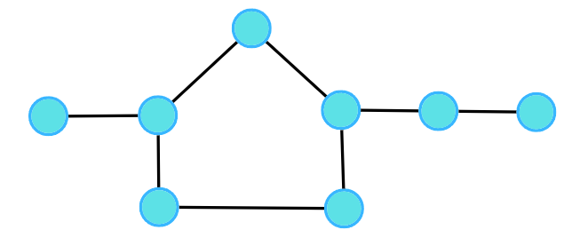
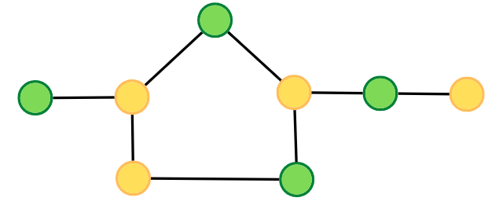
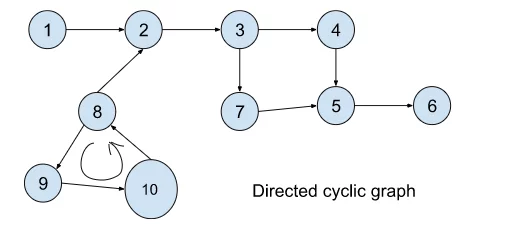

# Basic terminologies ->

1. **Graph**: A representation of connections between nodes or vertices. Types include undirected (no specific direction) and directed (with specific direction) graphs.

2. **Node/Vertex**: Represented by circles, these are the entities in a graph.

3. **Edge**: The connection between nodes. Can be undirected (bi-directional) or directed (one-way).

4. **Undirected Graph**: A graph where edges have no specific direction.

5. **Directed Graph**: A graph with edges having a specific direction.

6. **Cycle**: A path that starts and ends at the same node, leading to terms like undirected cyclic graph and directed cyclic graph.

7. **Path**: A sequence of vertices where each adjacent pair is connected by an edge.

8. **Degree**: In undirected graphs, it's the number of edges connected to a node. The total degree is twice the number of edges. In directed graphs, it's split into in-degree (incoming edges) and out-degree (outgoing edges).

9. **Edge Weight**: A numerical value assigned to edges, influencing the properties of the graph. If not specified, unit weight (1) is assumed.


# [BFS of graph](https://www.geeksforgeeks.org/problems/bfs-traversal-of-graph/1)

## Approach ->
To traverse in the graph breath wise just create a queue and a visited array of size n (number of nodes in the adjacency list). Now push the first element of the graph i.e. 0 in the queue and mark it as visited. Now keep popping from the queue and check if the popped element has some nodes attached to it in the adjacency list and keep marking the visited nodes to avoid duplication. You will have your answer.

## Code ->
```cpp
class Solution {
public:
    // Function to return Breadth First Traversal of given graph.
    vector<int> bfsOfGraph(int V, vector<int> adj[]) {
        // Code here

        // Vector to store the result of Breadth-First Traversal
        vector<int> ans;

        // Queue for BFS traversal
        queue<int> q;

        // Array to mark visited nodes
        int visited[V] = {0};

        // Start BFS from node 0
        q.push(0);
        visited[0] = 1; // Mark the starting node as visited

        // Perform BFS traversal
        while (q.size()) {
            // Get the front element of the queue
            int curr = q.front();
            q.pop();

            // Add the current node to the result
            ans.push_back(curr);

            // Iterate through the adjacency list of the current node
            for (int i = 0; i < adj[curr].size(); i++) {
                // Check if the neighbor is not visited
                if (visited[adj[curr][i]] == 0) {
                    // Push the neighbor to the queue and mark it as visited
                    q.push(adj[curr][i]);
                    visited[adj[curr][i]] = 1;
                }
            }
        }

        // Return the result of BFS traversal
        return ans;
    }
};
```
## Complexity analysis ->
Time Complexity: O(N) + O(2E), Where N = Nodes, 2E is for total degrees as we traverse all adjacent nodes. 2E because degree's formula is 2*Edges.

Let's break it down:

When we visit a node during the BFS traversal, we go through its adjacency list to visit its neighbors.
For each neighbor, we check if it has been visited before. If not, we add it to the queue and mark it as visited.
For an undirected graph, each edge contributes to the degree (number of neighbors) of both nodes it connects.
So, when we traverse the adjacency list of each node, we encounter each edge twice (once for each endpoint of the edge), leading to a factor of 2 in the time complexity analysis. Therefore, the time complexity is often expressed as O(N + 2E), but the constant factor is dropped, and it simplifies to O(N + E).

Simple example: Look at a graph right now and think if for each node say 0 aren't we visiting its one neighbour say 1 and for that neighbour 1 aren't we revisiting its neighbour 0. So aren't we visiting each edge twice?

Space Complexity: O(3N) ~ O(N), Space for queue data structure visited array and an adjacency list


# [DFS of Graph](https://www.geeksforgeeks.org/problems/depth-first-traversal-for-a-graph/1)

## Approach ->
Just use recursion and keep track of the visited nodes

## Code ->
```cpp
class Solution {
  private:
    void dfs(vector<int> &ans, int visited[], int node, vector<int> adj[]){
        ans.push_back(node);
        visited[node] = 1;
        
        for(int i=0; i<adj[node].size(); i++){
            if(!visited[adj[node][i]])
                dfs(ans, visited, adj[node][i], adj);
        }
    }
  public:
    // Function to return a list containing the DFS traversal of the graph.
    vector<int> dfsOfGraph(int V, vector<int> adj[]) {
        // Code here
        vector<int> ans;
        int visited[V] = {0};
        
        dfs(ans, visited, 0, adj);
        
        return ans;
    }
};
```
## Complexity analysis ->
Time Complexity: For an undirected graph, O(N) + O(2E), For a directed graph, O(N) + O(E), Because for every node we are calling the recursive function once, the time taken is O(N) and 2E is for total degrees as we traverse for all adjacent nodes.

Space Complexity: O(3N) ~ O(N), Space for dfs stack space, visited array and an adjacency list.

# [547. Number of Provinces](https://leetcode.com/problems/number-of-provinces/description/)

## Approach ->
Note that we are not given the adjacency matrix in this question, we are just given a matrix with the values 1 and 0 representing the adjacency matrix. So the dfs call will be a lot different from what we usually do in case of adjacency matrix. Or you can make yourself an adjacency matrix either but what's the fun in it? Try figuring out what we are doing in this q.

## Code ->
```cpp
class Solution {
public:
    // Depth-First Search (DFS) function to traverse the graph
    void dfs(int num, vector<int> &visited, vector<vector<int>> &isConnected) {
        // Mark the current city as visited
        visited[num] = 1;

        // Iterate through the isConnected list of the current city
        for (int i = 0; i < isConnected[num].size(); i++) {
            // Check if the current city is connected to city i and i is not visited
            if (isConnected[num][i] && !visited[i]) {
                // Recursively perform DFS on the connected city i
                dfs(i, visited, isConnected);
            }
        }
    }

    // Function to find the total number of provinces
    int findCircleNum(vector<vector<int>>& isConnected) {
        int ans = 0;
        int n = isConnected.size();

        // Vector to keep track of visited cities
        vector<int> visited(n, 0);

        // Iterate through all cities
        for (int i = 0; i < n; i++) {
            // Check if the current city is not visited
            if (!visited[i]) {
                // Increment the province count and perform DFS on the current city
                ans++;
                dfs(i, visited, isConnected);
            }
        }

        return ans;
    }
};
```

# [200. Number of Islands](https://leetcode.com/problems/number-of-islands/description/)

## Approach ->
The main idea is to visit all the neigbouring lands and mark them in the visited matrix. That way when we complete once cycle or marking, we know for a fact that we have discovered an island. SO maintain a matrix of visited places in the grid. Iterate through each cell in the grid and If the cell is unvisited or the grid is land then call dfs to mark the neighbouring lands as 1. Now with each dfs call we are marking the neighbouring lands as 1. After the call is completed all the neighbour lands are marked 1 and those lands combined form an island.

## Code ->
```cpp
class Solution {
public:
    // Function to check if a cell is valid for DFS
    bool isValid(int row, int col, vector<vector<char>> &grid, vector<vector<int>> &visited){
        // return false if out of bounds or grid's value is 0 or is already visited
        if(row<0 || row>grid.size()-1 || col<0 || col>grid[0].size()-1 || grid[row][col]=='0' || visited[row][col]==1) return false;
        else return true;
    }
    // Depth-First Search (DFS) function to explore and mark connected land cells in our visited matrix
    void dfs(int row, int col, vector<vector<char>> &grid, vector<vector<int>> &visited){
        visited[row][col] = 1;

        // Explore neighboring cells if valid
        if(isValid(row+1, col, grid, visited)) dfs(row+1, col, grid, visited);
        if(isValid(row-1, col, grid, visited)) dfs(row-1, col, grid, visited);
        if(isValid(row, col+1, grid, visited)) dfs(row, col+1, grid, visited);
        if(isValid(row, col-1, grid, visited)) dfs(row, col-1, grid, visited);
    }
    int numIslands(vector<vector<char>>& grid) {
        int ans = 0;
        vector<vector<int>> visited(grid.size(), vector<int>(grid[0].size(),0));

        // Iterate through each cell in the grid
        for(int i=0; i<grid.size(); i++){
            for(int j=0; j<grid[0].size(); j++){
                // If the cell is unvisited and represents land, start DFS
                if(!visited[i][j] && grid[i][j]=='1'){
                    dfs(i, j, grid, visited);
                    ans++;
                }
            }
        }

        return ans;
    }
};
```

# [733. Flood Fill](https://leetcode.com/problems/flood-fill/description/)

Easy peasy

# Code ->
```cpp
class Solution {
public:
    bool isValid(vector<vector<int>>& ans, int sr, int sc, int color, int elem){
        // Check if the pixel is within the bounds of the image and has the same color as the starting pixel.
        // Also, check if the pixel is not already colored with the new color.
        if(sr<0 || sc<0 || sr>=ans.size() || sc>=ans[0].size() || ans[sr][sc]!=elem || ans[sr][sc]==color)
            return false;
        else return true;
    }
    void bfs(vector<vector<int>>& image, int sr, int sc, int color, vector<vector<int>> &ans, int elem){
        // Set the color of the current pixel to the new color.
        ans[sr][sc] = color;

        // Check and recursively call DFS on the neighboring pixels in 4 directions.
        if(isValid(ans, sr+1, sc, color, elem)) bfs(image, sr+1, sc, color, ans, elem);
        if(isValid(ans, sr-1, sc, color, elem)) bfs(image, sr-1, sc, color, ans, elem);
        if(isValid(ans, sr, sc+1, color, elem)) bfs(image, sr, sc+1, color, ans, elem);
        if(isValid(ans, sr, sc-1, color, elem)) bfs(image, sr, sc-1, color, ans, elem);
    }
    vector<vector<int>> floodFill(vector<vector<int>>& image, int sr, int sc, int color) {
        // Create a copy of the original image.
        vector<vector<int>> ans(image.size(), vector<int>(image[0].size()));
        ans = image;

        // Start the flood fill from the specified pixel.
        bfs(image, sr, sc, color, ans, image[sr][sc]);
        return ans;
    }
};
```

# [994. Rotting Oranges](https://leetcode.com/problems/rotting-oranges/description/)

## Approach ->
The approach here is to use Breadth-First Search (BFS) traversal to simulate the rotting process of oranges.
BFS ensures that the traversal direction is consistent: left, right, up, and down and we are able to find minutes for each traversal. That way we can find out that in exactly how much time all the oranges are rotting. Using DFS this is not possible because we are going depth wise and not into a consistent 4 direction.

```cpp


class Solution {
public:
    // Helper function to check if a given position (i, j) is a valid fresh orange.
    bool isValid(vector<vector<int>>& grid, int i, int j){
        // Check if (i, j) is within the bounds of the grid and if it represents a fresh orange (1).
        return i >= 0 && j >= 0 && i < grid.size() && j < grid[0].size() && grid[i][j] == 1;
    }
    
    // Main function to calculate the minimum minutes required to rot all oranges.
    int orangesRotting(vector<vector<int>>& grid) {
        if(grid.empty()) return 0; // Handle the case where the grid is empty.
        
        int minutes = 0, total = 0, rotten = 0, row = grid.size(), col = grid[0].size();
        queue<pair<int, int>> q; // Queue to store the indexes of rotten oranges.
        
        // Push all already rotten oranges into the queue and calculate the total number of oranges (both fresh and rotten).
        // Finding total number of oranges is crucial because at the end we will compare total oranges with total oranges we have rotten.
        // If the total oranges present and total oranges we have rotten is equal, we will return minutes taken to rot all oranges, else return -1
        for(int i = 0; i < row; i++){
            for(int j = 0; j < col; j++){
                if(grid[i][j] == 2){
                    q.push({i, j});
                    total++;
                }
                else if(grid[i][j] == 1)
                    total++;
            }
        }       

        // Perform BFS to rot adjacent fresh oranges and update their status. Also, push their indexes into the queue.
        while(!q.empty()){
            int sizeOfQ = q.size();
            rotten += sizeOfQ; // Update the count of rotten oranges.

            // Rot adjacent fresh oranges and push their indexes into the queue.
            while(sizeOfQ--){
                int i = q.front().first, j = q.front().second;
                q.pop();
                
                if(isValid(grid, i + 1, j)) q.push({i + 1, j}), grid[i + 1][j] = 2;
                if(isValid(grid, i - 1, j)) q.push({i - 1, j}), grid[i - 1][j] = 2;
                if(isValid(grid, i, j + 1)) q.push({i, j + 1}), grid[i][j + 1] = 2;
                if(isValid(grid, i, j - 1)) q.push({i, j - 1}), grid[i][j - 1] = 2;
            }

            // If the queue is not empty, there are more rounds of rotting, so increase the minutes.
            if(!q.empty()) minutes++;
        }
        
        // If the total number of oranges equals the number of rotten oranges, return the minutes, else return -1.
        return total == rotten ? minutes : -1;
    }
};
```

TC -> O(m * n), SC -> O(m * n)

# [Detect cycle in an undirected graph](https://www.geeksforgeeks.org/problems/detect-cycle-in-an-undirected-graph/1)

## Approach 1 ->
We will detect cycle using BFS.

The idea is simple, suppose this is a graph we are given: 

1 -- 2
|    |
3 -- 4

When we start checking from 1 using BFS we push 1 in queue and see in the adj list that it connects to 2 and 3 and 2 and 3 are non visited so we mark them as visited and push 2 and 3 in our queue. 

Now we check for 2 from our queue. 2 is connected to 4 and 1. 4 is not visited so we mark 4 as visited and push in our queue. 1 is visited but 1 is also the parent of 2 so because of the parent fact we ignore 1.

Now we check for 3 from our queue. 3 is connected to 1 and 3. 1 is visited but it is the parent of 3 so we ignore 1. 4 is also visited but its not the parent of 3. How can 4 be visited already and not be the parent? That clearly means that there is a cycle in our graph. So if someone was visited and it is not the parent then we have a cycle. 

We also have to keep in mind that there can be multiple provinces so run a loop for all the nodes in the main function and if they are not visited then call the isLoop/bfs function to check if loop exist.

## Code 1 ->
```cpp
class Solution {
private:
    // Helper function to perform BFS traversal and detect cycle
    bool isCycle(vector<int> adj[], vector<int> &visited, int elem) {
        visited[elem] = 1;
        queue<pair<int, int>> q;
        // Pushing the element and its parent into the queue
        q.push({elem, -1});

        while (q.size()) {
            elem = q.front().first;
            int parent = q.front().second;
            q.pop();

            // checking adj list of element
            for (int i = 0; i < adj[elem].size(); i++) {
                // If the neighbor is visited and not the parent, then there is a cycle
                if (visited[adj[elem][i]] && adj[elem][i] != parent)
                    return true;
                // If the neighbor is already visited and parent, continue to the next neighbor
                else if (visited[adj[elem][i]])
                    continue;

                // Push the neighbor and its parent (the element itself) into the queue and mark it as visited
                q.push({adj[elem][i], elem});
                visited[adj[elem][i]] = 1;
            }
        }
        return false;
    }

public:
    // Function to detect cycle in an undirected graph
    bool isCycle(int V, vector<int> adj[]) {
        vector<int> visited(V, 0);

        // Iterate through each vertex and check for cycles if they aren't visited ofcourse
        for (int i = 0; i < V; i++) {
            if (!visited[i])
                if (isCycle(adj, visited, i)) return true;
        }
        return false;
    }
};
```

Time Complexity: O(N + 2E) + O(N), Where N = Nodes, 2E is for total degrees as we traverse all adjacent nodes. In the case of connected components of a graph, it will take another O(N) time.

Space Complexity: O(N) + O(N) ~ O(N), Space for queue data structure and visited array.

# Approach 2 ->
Using DFS.

The approach is almost the same. We pass the parent of the elem too in the function call and we check for its adjacent elements. If the neighbour is visited and its not the parent we return true (i.e. cycle present), else we make the recursive call. If at any point our recursive call is returning true we finally return true.

## Code ->
```cpp
class Solution {
private:
    // Function to check for cycles using DFS.
    bool isCycle(vector<int> adj[], vector<int> &visited, int elem, int parent) {
        // Mark the current element as visited.
        visited[elem] = 1;

        // Iterate through the adjacent vertices.
        for (int i = 0; i < adj[elem].size(); i++) {
            // Check if the adjacent vertex is visited and not the parent.
            if (visited[adj[elem][i]] && adj[elem][i] != parent) {
                return true;  // Cycle detected.
            } else if (visited[adj[elem][i]]) {
                continue;  // Skip if already visited.
            }

            // Recursively call the function for the adjacent vertex.
            if (isCycle(adj, visited, adj[elem][i], elem)) {
                return true;  // if the recursive call is returning true, return true finally and break the recursive calls.
            }
        }

        return false;  // No cycle detected for the current vertex.
    }

public:
    // Function to detect cycle in an undirected graph.
    bool isCycle(int V, vector<int> adj[]) {
        vector<int> visited(V, 0);  // Initialize visited vector.

        // Iterate through each vertex.
        for (int i = 0; i < V; i++) {
            // Check if the vertex is unvisited.
            if (!visited[i]) {
                // Call the recursive DFS function to check for cycles.
                if (isCycle(adj, visited, i, -1)) {
                    return true;  // Cycle detected in the graph.
                }
            }
        }

        return false;  // No cycles found in the entire graph.
    }
};
```
Time Complexity: O(N + 2E) + O(N), Where N = Nodes, 2E is for total degrees as we traverse all adjacent nodes. In the case of connected components of a graph, it will take another O(N) time.

Space Complexity: O(N) + O(N) ~ O(N), Space for recursive stack space and visited array.

# [542. 01 Matrix](https://leetcode.com/problems/01-matrix/description/)

## Approach ->

Google asked this question so obviously hitting bfs from each cell when you find a 1 is not the approach its looking for, added that it will give TLE. So let's think of a better approach.

The intuition behind this solution is to use a multi-source BFS approach where you start from the positions of '0' and propagate outward to compute the distance of each cell from the nearest '0'. This is more efficient than running BFS from each '1' cell individually.

Here's a step-by-step explanation of the intuition:

1. Initialization:

Initialize a matrix (ans) to store the distances. Initialize it with -1, indicating that the distances are not yet computed.
Create a queue (q) to perform BFS.

2. Enqueue '0' Cells:

Iterate through the input matrix (mat).
Whenever you encounter a '0', enqueue its position into the queue (q) and set its distance in the ans matrix to 0.

3. BFS:

Start the BFS process by dequeuing a cell from the queue.

For the dequeued cell, check its neighboring cells:
-  If a neighboring cell is valid (within matrix boundaries and not visited yet), enqueue it.
-  Set the distance of the neighboring cell in the ans matrix to the current cell's distance plus 1.

4. Repeat BFS:

Continue the BFS process until the queue is empty.
The BFS will propagate from the '0' cells to their neighboring cells, updating the distances along the way.

5. Result:

The ans matrix will now contain the distances of each cell from the nearest '0'.


## Code -> 
```cpp
class Solution {
private:
    // Function to check if a cell is valid and has not been visited yet
    bool isValid(vector<vector<int>> &ans, int i, int j){
        if(i < 0 || j < 0 || i >= ans.size() || j >= ans[0].size() || ans[i][j] != -1)
            return false;
        else
            return true;
    }

public:
    // Function to update the matrix with distances from nearest 0
    vector<vector<int>> updateMatrix(vector<vector<int>>& mat) {
        // Initialize the answer matrix with -1 (unvisited) and a queue for BFS
        vector<vector<int>> ans(mat.size(), vector<int>(mat[0].size(), -1));
        queue<pair<int, int>> q;

        // Push the positions of '0' into the queue and set their distance to 0
        for(int i = 0; i < mat.size(); i++){
            for(int j = 0; j < mat[0].size(); j++){
                if(mat[i][j] == 0){
                    q.push({i, j});
                    ans[i][j] = 0;
                }
            }
        }

        // Perform BFS to update distances for other cells
        while(q.size()){
            int i = q.front().first;
            int j = q.front().second;

            q.pop();

            // Check and update distances for valid neighboring cells by simple if valid conditions
            // Could have used a while(size--) loop and checked isValid for each level but that that will give TLE
            // and there is no need also because we don't have anything to do with the levels specifically
            if(isValid(ans, i + 1, j)){
                q.push({i + 1, j});
                ans[i + 1][j] = ans[i][j] + 1;
            }
            if(isValid(ans, i - 1, j)){
                q.push({i - 1, j});
                ans[i - 1][j] = ans[i][j] + 1;
            }
            if(isValid(ans, i, j + 1)){
                q.push({i, j + 1});
                ans[i][j + 1] = ans[i][j] + 1;
            }
            if(isValid(ans, i, j - 1)){
                q.push({i, j - 1});
                ans[i][j - 1] = ans[i][j] + 1;
            }
        }

        return ans;
    }
};
```

# [130. Surrounded Regions](https://leetcode.com/problems/surrounded-regions/description/)

## Approach ->

This is a very simple question if you are able to observe one thing. Think about it.

The only observation here is that the 0s that are on the boundary and 0s connected to the boundary 0s, all those 0s can never become X. All the other 0s can. So simply traverse the boundary and make every 0 as B and also the 0s connected to them as B recursively. When that is done, traverse the matrix and convert Bs to 0s and rest everything to X

## Code ->
```cpp
class Solution {
public:
    bool isValid(vector<vector<char>>& board, int i, int j){
        if(i>=0 && i<board.size() && j>=0 && j<board[0].size() && board[i][j]=='O')
            return true;
        return false;
    }
    void makeB(vector<vector<char>>& board, int i, int j){
        // make the current element B because it is a valid element i.e. lies in the range of the 2d array and also is a 'O'.
        board[i][j] = 'B';
        
        // check if the left, right, up and down elems are valid and if yes then call the function recursively.
        if(isValid(board, i+1, j))
            makeB(board, i+1, j);
        if(isValid(board, i-1, j))
            makeB(board, i-1, j);
        if(isValid(board, i, j+1))
            makeB(board, i, j+1);
        if(isValid(board, i, j-1))
            makeB(board, i, j-1);
    }
    void solve(vector<vector<char>>& board) {
        int row = board.size();
        int col = board[0].size();
        
        // Calling makeB for every corner elements of the 2d array
        // Make the cornor 'O's as 'B' and the 'O's connected to them as 'B' as well
        for(int i=0; i<row; i++){
            if(board[i][0] == 'O') makeB(board, i, 0);
            if(board[i][col-1] == 'O') makeB(board, i, col-1);
        }
        for(int i=0; i<col; i++){
            if(board[0][i] == 'O') makeB(board, 0, i);
            if(board[row-1][i] == 'O') makeB(board, row-1, i);
        }
        
        
        // Changing all the 'B' in the board to 'O'
        // Keep everything else as 'X'
        for(int i=0; i<row; i++)
            for(int j=0; j<col; j++)
                if(board[i][j] == 'B') board[i][j] = 'O';
                else board[i][j] = 'X';
    }
};
```

# [1020. Number of Enclaves](https://leetcode.com/problems/number-of-enclaves/description/)

## Approach ->
Exactly as same as the last one

## Code ->
```cpp
class Solution {
public:
    // Function to check if a cell is a valid land cell
    bool isValid(vector<vector<int>>& grid, int i, int j) {
        // Check if the indices are within the grid boundaries and the cell is land
        if (i >= 0 && j >= 0 && i < grid.size() && j < grid[0].size() && grid[i][j] == 1)
            return true;
        else
            return false;
    }

    // Function to mark connected land cells as water (set to 0)
    void makeZero(vector<vector<int>>& grid, int i, int j) {
        grid[i][j] = 0; // Mark the current land cell as water

        // Recursively mark neighboring land cells as water
        if (isValid(grid, i + 1, j)) makeZero(grid, i + 1, j);
        if (isValid(grid, i - 1, j)) makeZero(grid, i - 1, j);
        if (isValid(grid, i, j + 1)) makeZero(grid, i, j + 1);
        if (isValid(grid, i, j - 1)) makeZero(grid, i, j - 1);
    }

    // Main function to count the number of land cells that cannot reach the boundary
    int numEnclaves(vector<vector<int>>& grid) {
        int row = grid.size(), col = grid[0].size();

        // Mark connected land cells as water for the left and right boundaries
        for (int i = 0; i < row; i++) {
            if (grid[i][0] == 1) makeZero(grid, i, 0);
            if (grid[i][col - 1] == 1) makeZero(grid, i, col - 1);
        }

        // Mark connected land cells as water for the top and bottom boundaries
        for (int i = 0; i < col; i++) {
            if (grid[0][i] == 1) makeZero(grid, 0, i);
            if (grid[row - 1][i] == 1) makeZero(grid, row - 1, i);
        }

        int ans = 0;
        // Count the remaining land cells (not reachable from the boundary)
        for (int i = 0; i < row; i++)
            for (int j = 0; j < col; j++)
                if (grid[i][j] == 1) ans++;

        return ans;
    }
};
```

# [785. Is Graph Bipartite?](https://leetcode.com/problems/is-graph-bipartite/description/)

## Question Explanation ->
Problem Statement: Given an adjacency list of a graph adj of V no. of vertices having 0 based index. Check whether the graph is bipartite or not.

If we are able to colour a graph with two colours such that no adjacent nodes have the same colour, it is called a bipartite graph.

## Example ->
Input 1:


Output: True


Input 2:




Output: False

## Approaches ->
1. BFS:

 This code checks if a graph is bipartite, meaning it can be split into two independent sets of nodes, ensuring that no two connected nodes share the same color. First thing to notice here is that the graph might be disconnected. It handles disconnected graphs by iterating through each unprocessed node and running a breadth-first search (BFS) for each component.

The approach involves using a visited vector to mark nodes as uncolored (-1). During BFS, nodes are colored alternatively (1 or 2). If, at any point, a node's neighbor has the same color as itself and the neighbour is not the parent of the node, the graph is not bipartite.

## Code ->
```cpp
class Solution {
public:
    // BFS function to check if a connected component is bipartite
    bool bfs(vector<vector<int>> &graph, vector<int> &visited, int i) {
        queue<pair<int, int>> q;
        q.push({i, 1}); // Start with node i, color 1
        visited[i] = 1; // Mark the current node as color 1

        while (q.size()) {
            int curr = q.front().first;
            int color = q.front().second;
            q.pop();

            for (int i = 0; i < graph[curr].size(); i++) {
                int neighbour = graph[curr][i]; // Extract the neighbour/child of the parent

                if (neighbour == curr) continue; // Skip parent node

                if (visited[neighbour] == -1) {
                    // If neighbour is not visited, color it with the opposite color in visited vector
                    int newColor = (color == 1) ? 2 : 1;
                    visited[neighbour] = newColor;

                    // Push the neighbour in queue with its corresponding color
                    q.push({neighbour, newColor});
                } else {
                    // If the neighbour has the same color as the current node, graph is not bipartite
                    if (visited[neighbour] == color) return false;
                }
            }
        }

        return true; // The connected component is bipartite
    }

    // Function to check if the entire graph is bipartite (handles disconnected graphs)
    bool isBipartite(vector<vector<int>> &graph) {
        vector<int> visited(graph.size(), -1); // Initialize visited vector

        // Iterate through each node in the graph
        for (int i = 0; i < graph.size(); i++) {
            // Check if the node is not already processed and run BFS for each unprocessed node
            if (visited[i] == -1 && !bfs(graph, visited, i)) return false;
        }

        return true; // The entire graph is bipartite
    }
};
```

2. DFS:

## Code ->
```cpp
class Solution {
private: 
    bool dfs(int node, int col, int color[], vector<int> adj[]) {
        color[node] = col; 
        
        // traverse adjacent nodes
        for(auto it : adj[node]) {
            // if uncoloured
            if(color[it] == -1) {
                if(dfs(it, !col, color, adj) == false) return false; 
            }
            // if previously coloured and have the same colour
            else if(color[it] == col) {
                return false; 
            }
        }
        
        return true; 
    }
public:
	bool isBipartite(int V, vector<int>adj[]){
	    int color[V];
	    for(int i = 0;i<V;i++) color[i] = -1; 
	    
	    // for connected components
	    for(int i = 0;i<V;i++) {
	        if(color[i] == -1) {
	            if(dfs(i, 0, color, adj) == false) 
	                return false; 
	        }
	    }
	    return true; 
	}
};
```
# [Detect cycle in a directed graph (Using DFS)](https://www.geeksforgeeks.org/problems/detect-cycle-in-a-directed-graph/1)
## Approach ->



In the directed graph shown above, let's try to figure out if the normal cycle detection algo of a undirected graph work or not.  The undirected dfs algo won't work because look at the example, if you traverse in this graph using the directed graph DFS algo then it will detect the loop at 3,4,5,7 but if you carefully observe there is no loop because of the directions of the edges. But there is a loop at 8,9 and 10. 

In the directed graph cycle detection algorithm, we use two vectors: one to mark visited nodes and another to track nodes visited in the current path. As we traverse the graph, if we encounter a node that is already in the current path, it suggests a cycle. To prevent false positives, we reset the path vector to 0 when we complete the current path. This strategy ensures accurate cycle detection in directed graphs, addressing the limitations of the undirected cycle detection algorithm.

Look at the code to understand properly...

## Code ->
```cpp
class Solution {
public:
    // Function to detect cycle in a directed graph using DFS.
    bool dfs(vector<int> adj[], vector<int> &visited, vector<int> &pathVisited, int node, int V) {
        visited[node] = 1;          // Mark the current node as visited
        pathVisited[node] = 1;      // Mark the current node as visited in the current DFS path

        // Iterate through the neighbors of the current node
        for (int i = 0; i < adj[node].size(); i++) {
            // If the neighbor is not visited, recursively call DFS for that neighbor
            if (!visited[adj[node][i]]) {
                if (dfs(adj, visited, pathVisited, adj[node][i], V)) return true; // break the recursion and return true if dfs return true
            }
            // If the neighbor is already visited in the current DFS path, a cycle is detected
            else {
                if (pathVisited[adj[node][i]]) return true;
            }
        }

        pathVisited[node] = 0;  // Reset pathVisited for the current node after exploration
        return false;           // No cycle found in the current DFS path
    }

    // Function to check if a directed graph contains a cycle.
    bool isCyclic(int V, vector<int> adj[]) {
        vector<int> visited(V, 0);       // Array to track visited nodes
        vector<int> pathVisited(V, 0);   // Array to track visited nodes in the current DFS path

        // Iterate through each node in the graph
        for (int i = 0; i < V; i++) {
            // If the node is not visited, start DFS from that node
            if (!visited[i]) {
                if (dfs(adj, visited, pathVisited, i, V)) return true;  // If cycle found, return true
            }
        }

        return false;  // No cycle found in the entire graph
    }
};
```

# [802. Find Eventual Safe States](https://leetcode.com/problems/find-eventual-safe-states/description/)

## Approaches ->
1. 
In this q we are simply checking for the cycle. Because if a node is safe then it must eventually stop at a terminal node. And if a node is not safe then ofcouse it will not stop at any node. A terminal node is the node which points to no other node. Hence if we do not detect a cycle for a given node, that node is safe. To check cycle we have applied dfs cycle detection technique. And we are checking the cycle for each nodes seperately. TC-> O(N^2)

## Code ->
```cpp
class Solution {
public:
    bool detectCycle(int i, vector<vector<int>> &adj, vector<int> &visited, vector<int> &curVisited){
        visited[i] = 1;
        curVisited[i] = 1;
        
        for(auto a: adj[i]){
            if(!visited[a]){
                if(detectCycle(a, adj, visited, curVisited)) return true;
            }
            else if(curVisited[a]) return true;
        }
        
        curVisited[i] = 0;
        return false;
    }
    vector<int> eventualSafeNodes(vector<vector<int>>& graph) {
        vector <int> ans;
        vector <int> visited(graph.size(), 0);
        vector <int> curVisited(graph.size(), 0);
        
        for(int i=0; i<graph.size(); i++){
            if(!detectCycle(i, graph, visited, curVisited)) ans.push_back(i);
        }
        
        return ans;
    }
};
```

2. We can improve our TC to O(N + 2E) by simply obversving the following: 
If we run the dfs for only the non visited nodes and we keep marking the visited nodes as 1, we can save a lot of time. We can do this because we are also maintaining curVisited array. CurVisited is always eventually 0 for the nodes that do not have cycle in it but is 1 for the path/nodes that have cycle. We can take advantage of that and write our code the following way ->

## Code ->
```cpp
class Solution {
public:
    // Same as before
    bool detectCycle(int i, vector<vector<int>> &adj, vector<int> &visited, vector<int> &curVisited){
        visited[i] = 1;
        curVisited[i] = 1;
        
        for(auto a: adj[i]){
            if(!visited[a]){
                if(detectCycle(a, adj, visited, curVisited)) return true;
            }
            else if(curVisited[a]) return true;
        }
        
        curVisited[i] = 0;
        return false;
    }
    vector<int> eventualSafeNodes(vector<vector<int>>& graph) {
        vector <int> ans;
        vector <int> visited(graph.size(), 0);
        vector <int> curVisited(graph.size(), 0);
        
        // if not visited then call the cycle detection dfs
        for(int i=0; i<graph.size(); i++){
            if(!visited[i])
                detectCycle(i, graph, visited, curVisited);
        }

        // the curVisited will always be 1 for the path that had a cycle
        // so it will obviously be 0 for the safe paths/nodes
        for(int i=0; i<curVisited.size(); i++){
            // simply push the nodes that has 0 in their curVisited array into our ans
            if(curVisited[i]==0) ans.push_back(i);
        }
        
        return ans;
    }
};
```

# [Topological sort - Kahn’s Algorithm/BFS](https://www.geeksforgeeks.org/problems/topological-sort/1?itm_source=geeksforgeeks&itm_medium=article&itm_campaign=bottom_sticky_on_article)

## Approach ->
The code aims to perform a topological sort on a directed acyclic graph (DAG)

Topological Sort:

An ordering of the vertices in a directed graph where each directed edge goes from a vertex earlier in the order to a vertex later in the order. In simple words the algo states that the vertex that is the least dependent (i.e. the node that has the least indegree aka least number of incoming edges) will be printed first in the topological sort algo and the vertex that are dependent on other vertices, are printed later.

Directed Acyclic Graph (DAG):

A directed graph without cycles, meaning there are no closed loops in the relationships between vertices. This is important for a topological sort.

So we will take the following approach to solve this using Kahn's algo aka BFS:

1. We will make an indegree vector that will store the indegree of all the vertices present in the graph.  Each element at index i represents the in-degree of vertex i.
2. Create an empty queue (q). And for each node that had no dependency i.e. indegree == 0, push it in our queue.
3. Perform simple bfs and when we pop out an element/node from queue, push it in our ans. Then for all the adjacent elements of our node just keep reducing its indegree. 
4. When the indegree of an element is reduced to 0 then push it in our queue. Look at the code for further understanding...

## Code ->
```cpp
class Solution
{
	public:
	//Function to return list containing vertices in Topological order. 
	vector<int> topoSort(int V, vector<int> adj[]) 
	{
	    vector<int> ans;
        // Step 1: Create an indegree vector and calculate in-degrees for each element
        // Push it in our indegree vector
	    vector<int> indegree(V, 0);
	    for(int i=0; i<V; i++){
	        int size = adj[i].size();
	        for(int j=0; j<size; j++){
	            indegree[adj[i][j]]++;  
	        } 
	    }
	    
	   // Step 2: Create a queue and initially push all vertices with in-degree 0
	    queue<int> q;
	    for(int i=0; i<V; i++){
	        if(indegree[i]==0) q.push(i);
	    }
	    
	   // Step 3: Perform BFS (while the queue is not empty)
	    while(q.size()){
	        int curr = q.front();  // Take the front node from the queue
            q.pop();
            ans.push_back(curr);  // Add it to the topological order

            // Iterate through the adjacent vertices of the current node
            for(int i = 0; i < adj[curr].size(); i++){
                indegree[adj[curr][i]]--;  // Reduce in-degree of adjacent vertices

                // If the new in-degree becomes 0, push the vertex to the queue
                if(indegree[adj[curr][i]] == 0) 
                    q.push(adj[curr][i]);
            }
        }
	    
	    return ans;
	}
};
```

Time Complexity: O(V+E), where V = no. of nodes and E = no. of edges. This is a simple BFS algorithm.

Space Complexity: O(N) + O(N) ~ O(2N), O(N) for the indegree array, and O(N) for the queue data structure used in BFS(where N = no.of nodes).

# [Topological sort - Using DFS](https://www.geeksforgeeks.org/problems/topological-sort/1?itm_source=geeksforgeeks&itm_medium=article&itm_campaign=bottom_sticky_on_article)

## Approach ->
We will be solving it using the DFS traversal technique. DFS goes in-depth, i.e., traverses all nodes by going ahead, and when there are no further nodes to traverse in the current path, then it backtracks on the same path and traverses other unvisited nodes. The intuition is that as we keep going the depthts of the tree, we will eventually reach a node which is the most dependant, so push it in our stack. And as we backtrack, we reach the nodes that are less dependant so keep pushing them and we'll have our dependant nodes in sorted order of their dependancy

The algorithm steps are as follows:

1. We must traverse all components of the graph.
2. Make sure to carry a visited array(all elements are initialized to 0) and a stack data structure, where we are going to store the nodes after completing the DFS call.
3. In the DFS call, first, the current node is marked as visited. Then DFS call is made for all its adjacent nodes.
4. After visiting all its adjacent nodes, DFS will backtrack to the previous node and meanwhile, the current node is pushed into the stack.
5. Finally, we will get the stack containing one of the topological sortings of the graph. We can use an array instead of stack as well. In the code I have used an array and then reversed it at the end.

## Code ->
```cpp
class Solution {
public:
    // Helper function for Depth-First Search (DFS)
    void DFS(int i, vector<int>& ans, vector<int>& visited, vector<int> adj[]) {
        visited[i] = 1;  // Step 3: Mark the current node as visited
        for (auto neighbor : adj[i]) {
            if (visited[neighbor] == 0) {
                // Step 3: Recursively call DFS for unvisited neighbors
                DFS(neighbor, ans, visited, adj);
            }
        }
        ans.push_back(i);  // Step 4: Push the current node into the result after visiting all neighbors
    }

    // Function to return a list containing vertices in Topological order.
    vector<int> topoSort(int V, vector<int> adj[]) {
        vector<int> ans;      // Vector to store the topological order
        vector<int> visited(V, 0);  // Step 2: Array to keep track of visited nodes

        // Step 1: Iterate through all nodes in the graph
        for (int i = 0; i < V; i++) {
            if (visited[i] == 0) {
                // Step 2: Call DFS for unvisited nodes
                DFS(i, ans, visited, adj);
            }
        }

        // Step 5: Reverse the order to get the final topological sort
        reverse(ans.begin(), ans.end());
        return ans;
    }
};
```

# [Detect cycle in a directed graph (USING BFS)](https://www.geeksforgeeks.org/problems/detect-cycle-in-a-directed-graph/1)

## Approach ->
We have already solved this using DFS. Now we will solve it using BFS. This is an implementation of Kahn's algo.

Simply run the Kahn's algo and we know for a fact that Kahn's algo only runs (topo sort only runs) for DAG (Directed Asyclic Graph). So if there is a cycle then it will not run for all its nodes. 

## Code ->
```cpp
class Solution {
  public:
    // Function to detect cycle in a directed graph.
    bool isCyclic(int V, vector<int> adj[]) {
        // code here
         vector<int> indegree(V, 0);
	    
	    for(int i=0; i<V; i++){
	        int size = adj[i].size();
	        for(int j=0; j<size; j++){
	            indegree[adj[i][j]]++;  
	        } 
	    }
	    
	    queue<int> q;
	    int cnt = 0;
	    
	    for(int i=0; i<V; i++){
	        if(indegree[i]==0) q.push(i);
	    }
	    
	    while(q.size()){
	        int curr = q.front(); 
	        q.pop();
	        // increase the count if we find an element in our queue
	        cnt++;
	        
	        for(int i=0; i<adj[curr].size(); i++){
	            indegree[adj[curr][i]]--;
	            if(indegree[adj[curr][i]] == 0) q.push(adj[curr][i]);
	        }
	    }
	    
	    // if the number of elements processed are equal to no. of nodes then no loop present
	    return cnt==V ? false : true;
    }
};
```

# [210. Course Schedule II](https://leetcode.com/problems/course-schedule-ii/description/) && [207. Course Schedule](https://leetcode.com/problems/course-schedule/description/)

## Approach for Course Schedule II->
The solutions will be similar for both questions as we need to check for one, and in the other, we need to print the order. The questions state that the given pairs signify the dependencies of tasks. For example, the pair {u, v} signifies that to perform task v, first we need to finish task u. Now, if we closely observe, we can think of a directed edge between u and v(u -> v) where u and v are two nodes. Now, if we can think of each task as a node and every pair as a directed edge between those two nodes, the whole problem becomes a graph problem of topological sort. We clearly have dependencies here so it's a normal topo sort problem.

## Code ->
```cpp
class Solution {
public:
    // Helper function to create an adjacency list from prerequisites
    void makeAdj(vector<vector<int>> &adj, vector<vector<int>> &prerequisites) {
        for (int i = 0; i < prerequisites.size(); i++) {
            adj[prerequisites[i][0]].push_back(prerequisites[i][1]);
        }
    }

    // Main function to find the order of courses to be taken
    vector<int> findOrder(int numCourses, vector<vector<int>>& prerequisites) {
        vector<vector<int>> adj(numCourses);
        makeAdj(adj, prerequisites);  // Step 1: Create an adjacency list

        vector<int> indegree(numCourses, 0);  // Step 2: Calculate indegree for each course

        for (int i = 0; i < prerequisites.size(); i++) {
            indegree[prerequisites[i][1]]++;
        }

        queue<int> q;
        vector<int> ans;

        // Step 3: Push courses with indegree 0 into the queue
        for (int i = 0; i < indegree.size(); i++) {
            if (indegree[i] == 0) q.push(i);
        }

        // Step 4: Perform topological sort using BFS
        while (q.size()) {
            int curr = q.front();
            q.pop();
            ans.push_back(curr);

            // Reduce indegree of adjacent courses and push those with indegree 0
            for (int i = 0; i < adj[curr].size(); i++) {
                indegree[adj[curr][i]]--;
                if (indegree[adj[curr][i]] == 0) q.push(adj[curr][i]);
            }
        }

        // Step 5: Check if all courses can be completed, otherwise return an empty vector
        if (ans.size() != numCourses) return {};
        
        reverse(ans.begin(), ans.end());  // Reverse the order to get the final result
        return ans;
    }
};
```