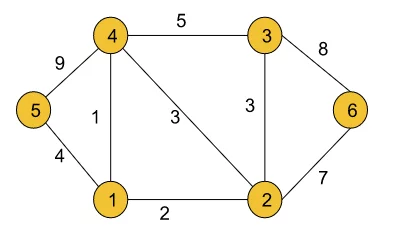
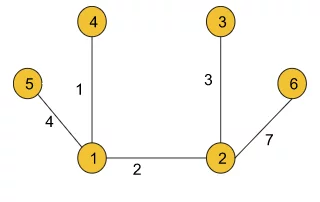
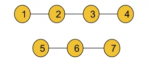

# Basic terminologies ->

1. **Graph**: A representation of connections between nodes or vertices. Types include undirected (no specific direction) and directed (with specific direction) graphs.

2. **Node/Vertex**: Represented by circles, these are the entities in a graph.

3. **Edge**: The connection between nodes. Can be undirected (bi-directional) or directed (one-way).

4. **Undirected Graph**: A graph where edges have no specific direction.

5. **Directed Graph**: A graph with edges having a specific direction.

6. **Cycle**: A path that starts and ends at the same node, leading to terms like undirected cyclic graph and directed cyclic graph.

7. **Path**: A sequence of vertices where each adjacent pair is connected by an edge.

8. **Degree**: In undirected graphs, it's the number of edges connected to a node. The total degree is twice the number of edges. In directed graphs, it's split into in-degree (incoming edges) and out-degree (outgoing edges).

9. **Edge Weight**: A numerical value assigned to edges, influencing the properties of the graph. If not specified, unit weight (1) is assumed.


# [BFS of graph](https://www.geeksforgeeks.org/problems/bfs-traversal-of-graph/1)

## Approach ->
To traverse in the graph breath wise just create a queue and a visited array of size n (number of nodes in the adjacency list). Now push the first element of the graph i.e. 0 in the queue and mark it as visited. Now keep popping from the queue and check if the popped element has some nodes attached to it in the adjacency list and keep marking the visited nodes to avoid duplication. You will have your answer.

## Code ->
```cpp
class Solution {
public:
    // Function to return Breadth First Traversal of given graph.
    vector<int> bfsOfGraph(int V, vector<int> adj[]) {
        // Code here

        // Vector to store the result of Breadth-First Traversal
        vector<int> ans;

        // Queue for BFS traversal
        queue<int> q;

        // Array to mark visited nodes
        int visited[V] = {0};

        // Start BFS from node 0
        q.push(0);
        visited[0] = 1; // Mark the starting node as visited

        // Perform BFS traversal
        while (q.size()) {
            // Get the front element of the queue
            int curr = q.front();
            q.pop();

            // Add the current node to the result
            ans.push_back(curr);

            // Iterate through the adjacency list of the current node
            for (int i = 0; i < adj[curr].size(); i++) {
                // Check if the neighbor is not visited
                if (visited[adj[curr][i]] == 0) {
                    // Push the neighbor to the queue and mark it as visited
                    q.push(adj[curr][i]);
                    visited[adj[curr][i]] = 1;
                }
            }
        }

        // Return the result of BFS traversal
        return ans;
    }
};
```
## Complexity analysis ->
Time Complexity: O(N) + O(2E), Where N = Nodes, 2E is for total degrees as we traverse all adjacent nodes. 2E because degree's formula is 2*Edges.

Let's break it down:

When we visit a node during the BFS traversal, we go through its adjacency list to visit its neighbors.
For each neighbor, we check if it has been visited before. If not, we add it to the queue and mark it as visited.
For an undirected graph, each edge contributes to the degree (number of neighbors) of both nodes it connects.
So, when we traverse the adjacency list of each node, we encounter each edge twice (once for each endpoint of the edge), leading to a factor of 2 in the time complexity analysis. Therefore, the time complexity is often expressed as O(N + 2E), but the constant factor is dropped, and it simplifies to O(N + E).

Simple example: Look at a graph right now and think if for each node say 0 aren't we visiting its one neighbour say 1 and for that neighbour 1 aren't we revisiting its neighbour 0. So aren't we visiting each edge twice?

Space Complexity: O(3N) ~ O(N), Space for queue data structure visited array and an adjacency list


# [DFS of Graph](https://www.geeksforgeeks.org/problems/depth-first-traversal-for-a-graph/1)

## Approach ->
Just use recursion and keep track of the visited nodes

## Code ->
```cpp
class Solution {
  private:
    void dfs(vector<int> &ans, int visited[], int node, vector<int> adj[]){
        ans.push_back(node);
        visited[node] = 1;
        
        for(int i=0; i<adj[node].size(); i++){
            if(!visited[adj[node][i]])
                dfs(ans, visited, adj[node][i], adj);
        }
    }
  public:
    // Function to return a list containing the DFS traversal of the graph.
    vector<int> dfsOfGraph(int V, vector<int> adj[]) {
        // Code here
        vector<int> ans;
        int visited[V] = {0};
        
        dfs(ans, visited, 0, adj);
        
        return ans;
    }
};
```
## Complexity analysis ->
Time Complexity: For an undirected graph, O(N) + O(2E), For a directed graph, O(N) + O(E), Because for every node we are calling the recursive function once, the time taken is O(N) and 2E is for total degrees as we traverse for all adjacent nodes.

Space Complexity: O(3N) ~ O(N), Space for dfs stack space, visited array and an adjacency list.

# [547. Number of Provinces](https://leetcode.com/problems/number-of-provinces/description/)

## Approach ->
Note that we are not given the adjacency matrix in this question, we are just given a matrix with the values 1 and 0 representing the adjacency matrix. So the dfs call will be a lot different from what we usually do in case of adjacency matrix. Or you can make yourself an adjacency matrix either but what's the fun in it? Try figuring out what we are doing in this q.

## Code ->
```cpp
class Solution {
public:
    // Depth-First Search (DFS) function to traverse the graph
    void dfs(int num, vector<int> &visited, vector<vector<int>> &isConnected) {
        // Mark the current city as visited
        visited[num] = 1;

        // Iterate through the isConnected list of the current city
        for (int i = 0; i < isConnected[num].size(); i++) {
            // Check if the current city is connected to city i and i is not visited
            if (isConnected[num][i] && !visited[i]) {
                // Recursively perform DFS on the connected city i
                dfs(i, visited, isConnected);
            }
        }
    }

    // Function to find the total number of provinces
    int findCircleNum(vector<vector<int>>& isConnected) {
        int ans = 0;
        int n = isConnected.size();

        // Vector to keep track of visited cities
        vector<int> visited(n, 0);

        // Iterate through all cities
        for (int i = 0; i < n; i++) {
            // Check if the current city is not visited
            if (!visited[i]) {
                // Increment the province count and perform DFS on the current city
                ans++;
                dfs(i, visited, isConnected);
            }
        }

        return ans;
    }
};
```

# [200. Number of Islands](https://leetcode.com/problems/number-of-islands/description/)

## Approach ->
The main idea is to visit all the neigbouring lands and mark them in the visited matrix. That way when we complete once cycle or marking, we know for a fact that we have discovered an island. SO maintain a matrix of visited places in the grid. Iterate through each cell in the grid and If the cell is unvisited or the grid is land then call dfs to mark the neighbouring lands as 1. Now with each dfs call we are marking the neighbouring lands as 1. After the call is completed all the neighbour lands are marked 1 and those lands combined form an island.

## Code ->
```cpp
class Solution {
public:
    // Function to check if a cell is valid for DFS
    bool isValid(int row, int col, vector<vector<char>> &grid, vector<vector<int>> &visited){
        // return false if out of bounds or grid's value is 0 or is already visited
        if(row<0 || row>grid.size()-1 || col<0 || col>grid[0].size()-1 || grid[row][col]=='0' || visited[row][col]==1) return false;
        else return true;
    }
    // Depth-First Search (DFS) function to explore and mark connected land cells in our visited matrix
    void dfs(int row, int col, vector<vector<char>> &grid, vector<vector<int>> &visited){
        visited[row][col] = 1;

        // Explore neighboring cells if valid
        if(isValid(row+1, col, grid, visited)) dfs(row+1, col, grid, visited);
        if(isValid(row-1, col, grid, visited)) dfs(row-1, col, grid, visited);
        if(isValid(row, col+1, grid, visited)) dfs(row, col+1, grid, visited);
        if(isValid(row, col-1, grid, visited)) dfs(row, col-1, grid, visited);
    }
    int numIslands(vector<vector<char>>& grid) {
        int ans = 0;
        vector<vector<int>> visited(grid.size(), vector<int>(grid[0].size(),0));

        // Iterate through each cell in the grid
        for(int i=0; i<grid.size(); i++){
            for(int j=0; j<grid[0].size(); j++){
                // If the cell is unvisited and represents land, start DFS
                if(!visited[i][j] && grid[i][j]=='1'){
                    dfs(i, j, grid, visited);
                    ans++;
                }
            }
        }

        return ans;
    }
};
```

# [733. Flood Fill](https://leetcode.com/problems/flood-fill/description/)

Easy peasy

# Code ->
```cpp
class Solution {
public:
    bool isValid(vector<vector<int>>& ans, int sr, int sc, int color, int elem){
        // Check if the pixel is within the bounds of the image and has the same color as the starting pixel.
        // Also, check if the pixel is not already colored with the new color.
        if(sr<0 || sc<0 || sr>=ans.size() || sc>=ans[0].size() || ans[sr][sc]!=elem || ans[sr][sc]==color)
            return false;
        else return true;
    }
    void bfs(vector<vector<int>>& image, int sr, int sc, int color, vector<vector<int>> &ans, int elem){
        // Set the color of the current pixel to the new color.
        ans[sr][sc] = color;

        // Check and recursively call DFS on the neighboring pixels in 4 directions.
        if(isValid(ans, sr+1, sc, color, elem)) bfs(image, sr+1, sc, color, ans, elem);
        if(isValid(ans, sr-1, sc, color, elem)) bfs(image, sr-1, sc, color, ans, elem);
        if(isValid(ans, sr, sc+1, color, elem)) bfs(image, sr, sc+1, color, ans, elem);
        if(isValid(ans, sr, sc-1, color, elem)) bfs(image, sr, sc-1, color, ans, elem);
    }
    vector<vector<int>> floodFill(vector<vector<int>>& image, int sr, int sc, int color) {
        // Create a copy of the original image.
        vector<vector<int>> ans(image.size(), vector<int>(image[0].size()));
        ans = image;

        // Start the flood fill from the specified pixel.
        bfs(image, sr, sc, color, ans, image[sr][sc]);
        return ans;
    }
};
```

# [994. Rotting Oranges](https://leetcode.com/problems/rotting-oranges/description/)

## Approach ->
The approach here is to use Breadth-First Search (BFS) traversal to simulate the rotting process of oranges.
BFS ensures that the traversal direction is consistent: left, right, up, and down and we are able to find minutes for each traversal. That way we can find out that in exactly how much time all the oranges are rotting. Using DFS this is not possible because we are going depth wise and not into a consistent 4 direction.

```cpp


class Solution {
public:
    // Helper function to check if a given position (i, j) is a valid fresh orange.
    bool isValid(vector<vector<int>>& grid, int i, int j){
        // Check if (i, j) is within the bounds of the grid and if it represents a fresh orange (1).
        return i >= 0 && j >= 0 && i < grid.size() && j < grid[0].size() && grid[i][j] == 1;
    }
    
    // Main function to calculate the minimum minutes required to rot all oranges.
    int orangesRotting(vector<vector<int>>& grid) {
        if(grid.empty()) return 0; // Handle the case where the grid is empty.
        
        int minutes = 0, total = 0, rotten = 0, row = grid.size(), col = grid[0].size();
        queue<pair<int, int>> q; // Queue to store the indexes of rotten oranges.
        
        // Push all already rotten oranges into the queue and calculate the total number of oranges (both fresh and rotten).
        // Finding total number of oranges is crucial because at the end we will compare total oranges with total oranges we have rotten.
        // If the total oranges present and total oranges we have rotten is equal, we will return minutes taken to rot all oranges, else return -1
        for(int i = 0; i < row; i++){
            for(int j = 0; j < col; j++){
                if(grid[i][j] == 2){
                    q.push({i, j});
                    total++;
                }
                else if(grid[i][j] == 1)
                    total++;
            }
        }       

        // Perform BFS to rot adjacent fresh oranges and update their status. Also, push their indexes into the queue.
        while(!q.empty()){
            int sizeOfQ = q.size();
            rotten += sizeOfQ; // Update the count of rotten oranges.

            // Rot adjacent fresh oranges and push their indexes into the queue.
            while(sizeOfQ--){
                int i = q.front().first, j = q.front().second;
                q.pop();
                
                if(isValid(grid, i + 1, j)) q.push({i + 1, j}), grid[i + 1][j] = 2;
                if(isValid(grid, i - 1, j)) q.push({i - 1, j}), grid[i - 1][j] = 2;
                if(isValid(grid, i, j + 1)) q.push({i, j + 1}), grid[i][j + 1] = 2;
                if(isValid(grid, i, j - 1)) q.push({i, j - 1}), grid[i][j - 1] = 2;
            }

            // If the queue is not empty, there are more rounds of rotting, so increase the minutes.
            if(!q.empty()) minutes++;
        }
        
        // If the total number of oranges equals the number of rotten oranges, return the minutes, else return -1.
        return total == rotten ? minutes : -1;
    }
};
```

TC -> O(m * n), SC -> O(m * n)

# [Detect cycle in an undirected graph](https://www.geeksforgeeks.org/problems/detect-cycle-in-an-undirected-graph/1)

## Approach 1 ->
We will detect cycle using BFS.

The idea is simple, suppose this is a graph we are given: 

1 -- 2
|    |
3 -- 4

When we start checking from 1 using BFS we push 1 in queue and see in the adj list that it connects to 2 and 3 and 2 and 3 are non visited so we mark them as visited and push 2 and 3 in our queue. 

Now we check for 2 from our queue. 2 is connected to 4 and 1. 4 is not visited so we mark 4 as visited and push in our queue. 1 is visited but 1 is also the parent of 2 so because of the parent fact we ignore 1.

Now we check for 3 from our queue. 3 is connected to 1 and 3. 1 is visited but it is the parent of 3 so we ignore 1. 4 is also visited but its not the parent of 3. How can 4 be visited already and not be the parent? That clearly means that there is a cycle in our graph. So if someone was visited and it is not the parent then we have a cycle. 

We also have to keep in mind that there can be multiple provinces so run a loop for all the nodes in the main function and if they are not visited then call the isLoop/bfs function to check if loop exist.

## Code 1 ->
```cpp
class Solution {
private:
    // Helper function to perform BFS traversal and detect cycle
    bool isCycle(vector<int> adj[], vector<int> &visited, int elem) {
        visited[elem] = 1;
        queue<pair<int, int>> q;
        // Pushing the element and its parent into the queue
        q.push({elem, -1});

        while (q.size()) {
            elem = q.front().first;
            int parent = q.front().second;
            q.pop();

            // checking adj list of element
            for (int i = 0; i < adj[elem].size(); i++) {
                // If the neighbor is visited and not the parent, then there is a cycle
                if (visited[adj[elem][i]] && adj[elem][i] != parent)
                    return true;
                // If the neighbor is already visited and parent, continue to the next neighbor
                else if (visited[adj[elem][i]])
                    continue;

                // Push the neighbor and its parent (the element itself) into the queue and mark it as visited
                q.push({adj[elem][i], elem});
                visited[adj[elem][i]] = 1;
            }
        }
        return false;
    }

public:
    // Function to detect cycle in an undirected graph
    bool isCycle(int V, vector<int> adj[]) {
        vector<int> visited(V, 0);

        // Iterate through each vertex and check for cycles if they aren't visited ofcourse
        for (int i = 0; i < V; i++) {
            if (!visited[i])
                if (isCycle(adj, visited, i)) return true;
        }
        return false;
    }
};
```

Time Complexity: O(N + 2E) + O(N), Where N = Nodes, 2E is for total degrees as we traverse all adjacent nodes. In the case of connected components of a graph, it will take another O(N) time.

Space Complexity: O(N) + O(N) ~ O(N), Space for queue data structure and visited array.

# Approach 2 ->
Using DFS.

The approach is almost the same. We pass the parent of the elem too in the function call and we check for its adjacent elements. If the neighbour is visited and its not the parent we return true (i.e. cycle present), else we make the recursive call. If at any point our recursive call is returning true we finally return true.

## Code ->
```cpp
class Solution {
private:
    // Function to check for cycles using DFS.
    bool isCycle(vector<int> adj[], vector<int> &visited, int elem, int parent) {
        // Mark the current element as visited.
        visited[elem] = 1;

        // Iterate through the adjacent vertices.
        for (int i = 0; i < adj[elem].size(); i++) {
            // Check if the adjacent vertex is visited and not the parent.
            if (visited[adj[elem][i]] && adj[elem][i] != parent) {
                return true;  // Cycle detected.
            } else if (visited[adj[elem][i]]) {
                continue;  // Skip if already visited.
            }

            // Recursively call the function for the adjacent vertex.
            if (isCycle(adj, visited, adj[elem][i], elem)) {
                return true;  // if the recursive call is returning true, return true finally and break the recursive calls.
            }
        }

        return false;  // No cycle detected for the current vertex.
    }

public:
    // Function to detect cycle in an undirected graph.
    bool isCycle(int V, vector<int> adj[]) {
        vector<int> visited(V, 0);  // Initialize visited vector.

        // Iterate through each vertex.
        for (int i = 0; i < V; i++) {
            // Check if the vertex is unvisited.
            if (!visited[i]) {
                // Call the recursive DFS function to check for cycles.
                if (isCycle(adj, visited, i, -1)) {
                    return true;  // Cycle detected in the graph.
                }
            }
        }

        return false;  // No cycles found in the entire graph.
    }
};
```
Time Complexity: O(N + 2E) + O(N), Where N = Nodes, 2E is for total degrees as we traverse all adjacent nodes. In the case of connected components of a graph, it will take another O(N) time.

Space Complexity: O(N) + O(N) ~ O(N), Space for recursive stack space and visited array.

# [542. 01 Matrix](https://leetcode.com/problems/01-matrix/description/)

## Approach ->

Google asked this question so obviously hitting bfs from each cell when you find a 1 is not the approach its looking for, added that it will give TLE. So let's think of a better approach.

The intuition behind this solution is to use a multi-source BFS approach where you start from the positions of '0' and propagate outward to compute the distance of each cell from the nearest '0'. This is more efficient than running BFS from each '1' cell individually.

Here's a step-by-step explanation of the intuition:

1. Initialization:

Initialize a matrix (ans) to store the distances. Initialize it with -1, indicating that the distances are not yet computed.
Create a queue (q) to perform BFS.

2. Enqueue '0' Cells:

Iterate through the input matrix (mat).
Whenever you encounter a '0', enqueue its position into the queue (q) and set its distance in the ans matrix to 0.

3. BFS:

Start the BFS process by dequeuing a cell from the queue.

For the dequeued cell, check its neighboring cells:
-  If a neighboring cell is valid (within matrix boundaries and not visited yet), enqueue it.
-  Set the distance of the neighboring cell in the ans matrix to the current cell's distance plus 1.

4. Repeat BFS:

Continue the BFS process until the queue is empty.
The BFS will propagate from the '0' cells to their neighboring cells, updating the distances along the way.

5. Result:

The ans matrix will now contain the distances of each cell from the nearest '0'.


## Code -> 
```cpp
class Solution {
private:
    // Function to check if a cell is valid and has not been visited yet
    bool isValid(vector<vector<int>> &ans, int i, int j){
        if(i < 0 || j < 0 || i >= ans.size() || j >= ans[0].size() || ans[i][j] != -1)
            return false;
        else
            return true;
    }

public:
    // Function to update the matrix with distances from nearest 0
    vector<vector<int>> updateMatrix(vector<vector<int>>& mat) {
        // Initialize the answer matrix with -1 (unvisited) and a queue for BFS
        vector<vector<int>> ans(mat.size(), vector<int>(mat[0].size(), -1));
        queue<pair<int, int>> q;

        // Push the positions of '0' into the queue and set their distance to 0
        for(int i = 0; i < mat.size(); i++){
            for(int j = 0; j < mat[0].size(); j++){
                if(mat[i][j] == 0){
                    q.push({i, j});
                    ans[i][j] = 0;
                }
            }
        }

        // Perform BFS to update distances for other cells
        while(q.size()){
            int i = q.front().first;
            int j = q.front().second;

            q.pop();

            // Check and update distances for valid neighboring cells by simple if valid conditions
            // Could have used a while(size--) loop and checked isValid for each level but that that will give TLE
            // and there is no need also because we don't have anything to do with the levels specifically
            if(isValid(ans, i + 1, j)){
                q.push({i + 1, j});
                ans[i + 1][j] = ans[i][j] + 1;
            }
            if(isValid(ans, i - 1, j)){
                q.push({i - 1, j});
                ans[i - 1][j] = ans[i][j] + 1;
            }
            if(isValid(ans, i, j + 1)){
                q.push({i, j + 1});
                ans[i][j + 1] = ans[i][j] + 1;
            }
            if(isValid(ans, i, j - 1)){
                q.push({i, j - 1});
                ans[i][j - 1] = ans[i][j] + 1;
            }
        }

        return ans;
    }
};
```

# [130. Surrounded Regions](https://leetcode.com/problems/surrounded-regions/description/)

## Approach ->

This is a very simple question if you are able to observe one thing. Think about it.

The only observation here is that the 0s that are on the boundary and 0s connected to the boundary 0s, all those 0s can never become X. All the other 0s can. So simply traverse the boundary and make every 0 as B and also the 0s connected to them as B recursively. When that is done, traverse the matrix and convert Bs to 0s and rest everything to X

## Code ->
```cpp
class Solution {
public:
    bool isValid(vector<vector<char>>& board, int i, int j){
        if(i>=0 && i<board.size() && j>=0 && j<board[0].size() && board[i][j]=='O')
            return true;
        return false;
    }
    void makeB(vector<vector<char>>& board, int i, int j){
        // make the current element B because it is a valid element i.e. lies in the range of the 2d array and also is a 'O'.
        board[i][j] = 'B';
        
        // check if the left, right, up and down elems are valid and if yes then call the function recursively.
        if(isValid(board, i+1, j))
            makeB(board, i+1, j);
        if(isValid(board, i-1, j))
            makeB(board, i-1, j);
        if(isValid(board, i, j+1))
            makeB(board, i, j+1);
        if(isValid(board, i, j-1))
            makeB(board, i, j-1);
    }
    void solve(vector<vector<char>>& board) {
        int row = board.size();
        int col = board[0].size();
        
        // Calling makeB for every corner elements of the 2d array
        // Make the cornor 'O's as 'B' and the 'O's connected to them as 'B' as well
        for(int i=0; i<row; i++){
            if(board[i][0] == 'O') makeB(board, i, 0);
            if(board[i][col-1] == 'O') makeB(board, i, col-1);
        }
        for(int i=0; i<col; i++){
            if(board[0][i] == 'O') makeB(board, 0, i);
            if(board[row-1][i] == 'O') makeB(board, row-1, i);
        }
        
        
        // Changing all the 'B' in the board to 'O'
        // Keep everything else as 'X'
        for(int i=0; i<row; i++)
            for(int j=0; j<col; j++)
                if(board[i][j] == 'B') board[i][j] = 'O';
                else board[i][j] = 'X';
    }
};
```

# [1020. Number of Enclaves](https://leetcode.com/problems/number-of-enclaves/description/)

## Approach ->
Exactly as same as the last one

## Code ->
```cpp
class Solution {
public:
    // Function to check if a cell is a valid land cell
    bool isValid(vector<vector<int>>& grid, int i, int j) {
        // Check if the indices are within the grid boundaries and the cell is land
        if (i >= 0 && j >= 0 && i < grid.size() && j < grid[0].size() && grid[i][j] == 1)
            return true;
        else
            return false;
    }

    // Function to mark connected land cells as water (set to 0)
    void makeZero(vector<vector<int>>& grid, int i, int j) {
        grid[i][j] = 0; // Mark the current land cell as water

        // Recursively mark neighboring land cells as water
        if (isValid(grid, i + 1, j)) makeZero(grid, i + 1, j);
        if (isValid(grid, i - 1, j)) makeZero(grid, i - 1, j);
        if (isValid(grid, i, j + 1)) makeZero(grid, i, j + 1);
        if (isValid(grid, i, j - 1)) makeZero(grid, i, j - 1);
    }

    // Main function to count the number of land cells that cannot reach the boundary
    int numEnclaves(vector<vector<int>>& grid) {
        int row = grid.size(), col = grid[0].size();

        // Mark connected land cells as water for the left and right boundaries
        for (int i = 0; i < row; i++) {
            if (grid[i][0] == 1) makeZero(grid, i, 0);
            if (grid[i][col - 1] == 1) makeZero(grid, i, col - 1);
        }

        // Mark connected land cells as water for the top and bottom boundaries
        for (int i = 0; i < col; i++) {
            if (grid[0][i] == 1) makeZero(grid, 0, i);
            if (grid[row - 1][i] == 1) makeZero(grid, row - 1, i);
        }

        int ans = 0;
        // Count the remaining land cells (not reachable from the boundary)
        for (int i = 0; i < row; i++)
            for (int j = 0; j < col; j++)
                if (grid[i][j] == 1) ans++;

        return ans;
    }
};
```

# [785. Is Graph Bipartite?](https://leetcode.com/problems/is-graph-bipartite/description/)

## Question Explanation ->
Problem Statement: Given an adjacency list of a graph adj of V no. of vertices having 0 based index. Check whether the graph is bipartite or not.

If we are able to colour a graph with two colours such that no adjacent nodes have the same colour, it is called a bipartite graph.

## Example ->
Input 1:


Output: True


Input 2:


Output: False

## Approaches ->
1. BFS:

 This code checks if a graph is bipartite, meaning it can be split into two independent sets of nodes, ensuring that no two connected nodes share the same color. First thing to notice here is that the graph might be disconnected. It handles disconnected graphs by iterating through each unprocessed node and running a breadth-first search (BFS) for each component.

The approach involves using a visited vector to mark nodes as uncolored (-1). During BFS, nodes are colored alternatively (1 or 2). If, at any point, a node's neighbor has the same color as itself and the neighbour is not the parent of the node, the graph is not bipartite.

## Code ->
```cpp
class Solution {
public:
    // BFS function to check if a connected component is bipartite
    bool bfs(vector<vector<int>> &graph, vector<int> &visited, int i) {
        queue<pair<int, int>> q;
        q.push({i, 1}); // Start with node i, color 1
        visited[i] = 1; // Mark the current node as color 1

        while (q.size()) {
            int curr = q.front().first;
            int color = q.front().second;
            q.pop();

            for (int i = 0; i < graph[curr].size(); i++) {
                int neighbour = graph[curr][i]; // Extract the neighbour/child of the parent

                if (neighbour == curr) continue; // Skip parent node

                if (visited[neighbour] == -1) {
                    // If neighbour is not visited, color it with the opposite color in visited vector
                    int newColor = (color == 1) ? 2 : 1;
                    visited[neighbour] = newColor;

                    // Push the neighbour in queue with its corresponding color
                    q.push({neighbour, newColor});
                } else {
                    // If the neighbour has the same color as the current node, graph is not bipartite
                    if (visited[neighbour] == color) return false;
                }
            }
        }

        return true; // The connected component is bipartite
    }

    // Function to check if the entire graph is bipartite (handles disconnected graphs)
    bool isBipartite(vector<vector<int>> &graph) {
        vector<int> visited(graph.size(), -1); // Initialize visited vector

        // Iterate through each node in the graph
        for (int i = 0; i < graph.size(); i++) {
            // Check if the node is not already processed and run BFS for each unprocessed node
            if (visited[i] == -1 && !bfs(graph, visited, i)) return false;
        }

        return true; // The entire graph is bipartite
    }
};
```

2. DFS:

## Code ->
```cpp
class Solution {
private: 
    bool dfs(int node, int col, int color[], vector<int> adj[]) {
        color[node] = col; 
        
        // traverse adjacent nodes
        for(auto it : adj[node]) {
            // if uncoloured
            if(color[it] == -1) {
                if(dfs(it, !col, color, adj) == false) return false; 
            }
            // if previously coloured and have the same colour
            else if(color[it] == col) {
                return false; 
            }
        }
        
        return true; 
    }
public:
	bool isBipartite(int V, vector<int>adj[]){
	    int color[V];
	    for(int i = 0;i<V;i++) color[i] = -1; 
	    
	    // for connected components
	    for(int i = 0;i<V;i++) {
	        if(color[i] == -1) {
	            if(dfs(i, 0, color, adj) == false) 
	                return false; 
	        }
	    }
	    return true; 
	}
};
```
# [Detect cycle in a directed graph (Using DFS)](https://www.geeksforgeeks.org/problems/detect-cycle-in-a-directed-graph/1)
## Approach ->


In the directed graph shown above, let's try to figure out if the normal cycle detection algo of a undirected graph work or not.  The undirected dfs algo won't work because look at the example, if you traverse in this graph using the directed graph DFS algo then it will detect the loop at 3,4,5,7 but if you carefully observe there is no loop because of the directions of the edges. But there is a loop at 8,9 and 10. 

In the directed graph cycle detection algorithm, we use two vectors: one to mark visited nodes and another to track nodes visited in the current path. As we traverse the graph, if we encounter a node that is already in the current path, it suggests a cycle. To prevent false positives, we reset the path vector to 0 when we complete the current path. This strategy ensures accurate cycle detection in directed graphs, addressing the limitations of the undirected cycle detection algorithm.

Look at the code to understand properly...

## Code ->
```cpp
class Solution {
public:
    // Function to detect cycle in a directed graph using DFS.
    bool dfs(vector<int> adj[], vector<int> &visited, vector<int> &pathVisited, int node, int V) {
        visited[node] = 1;          // Mark the current node as visited
        pathVisited[node] = 1;      // Mark the current node as visited in the current DFS path

        // Iterate through the neighbors of the current node
        for (int i = 0; i < adj[node].size(); i++) {
            // If the neighbor is not visited, recursively call DFS for that neighbor
            if (!visited[adj[node][i]]) {
                if (dfs(adj, visited, pathVisited, adj[node][i], V)) return true; // break the recursion and return true if dfs return true
            }
            // If the neighbor is already visited in the current DFS path, a cycle is detected
            else {
                if (pathVisited[adj[node][i]]) return true;
            }
        }

        pathVisited[node] = 0;  // Reset pathVisited for the current node after exploration
        return false;           // No cycle found in the current DFS path
    }

    // Function to check if a directed graph contains a cycle.
    bool isCyclic(int V, vector<int> adj[]) {
        vector<int> visited(V, 0);       // Array to track visited nodes
        vector<int> pathVisited(V, 0);   // Array to track visited nodes in the current DFS path

        // Iterate through each node in the graph
        for (int i = 0; i < V; i++) {
            // If the node is not visited, start DFS from that node
            if (!visited[i]) {
                if (dfs(adj, visited, pathVisited, i, V)) return true;  // If cycle found, return true
            }
        }

        return false;  // No cycle found in the entire graph
    }
};
```

# [802. Find Eventual Safe States](https://leetcode.com/problems/find-eventual-safe-states/description/)

## Approaches ->
1. 
In this q we are simply checking for the cycle. Because if a node is safe then it must eventually stop at a terminal node. And if a node is not safe then ofcouse it will not stop at any node. A terminal node is the node which points to no other node. Hence if we do not detect a cycle for a given node, that node is safe. To check cycle we have applied dfs cycle detection technique. And we are checking the cycle for each nodes seperately. TC-> O(N^2)

## Code ->
```cpp
class Solution {
public:
    bool detectCycle(int i, vector<vector<int>> &adj, vector<int> &visited, vector<int> &curVisited){
        visited[i] = 1;
        curVisited[i] = 1;
        
        for(auto a: adj[i]){
            if(!visited[a]){
                if(detectCycle(a, adj, visited, curVisited)) return true;
            }
            else if(curVisited[a]) return true;
        }
        
        curVisited[i] = 0;
        return false;
    }
    vector<int> eventualSafeNodes(vector<vector<int>>& graph) {
        vector <int> ans;
        vector <int> visited(graph.size(), 0);
        vector <int> curVisited(graph.size(), 0);
        
        for(int i=0; i<graph.size(); i++){
            if(!detectCycle(i, graph, visited, curVisited)) ans.push_back(i);
        }
        
        return ans;
    }
};
```

2. We can improve our TC to O(N + 2E) by simply obversving the following: 
If we run the dfs for only the non visited nodes and we keep marking the visited nodes as 1, we can save a lot of time. We can do this because we are also maintaining curVisited array. CurVisited is always eventually 0 for the nodes that do not have cycle in it but is 1 for the path/nodes that have cycle. We can take advantage of that and write our code the following way ->

## Code ->
```cpp
class Solution {
public:
    // Same as before
    bool detectCycle(int i, vector<vector<int>> &adj, vector<int> &visited, vector<int> &curVisited){
        visited[i] = 1;
        curVisited[i] = 1;
        
        for(auto a: adj[i]){
            if(!visited[a]){
                if(detectCycle(a, adj, visited, curVisited)) return true;
            }
            else if(curVisited[a]) return true;
        }
        
        curVisited[i] = 0;
        return false;
    }
    vector<int> eventualSafeNodes(vector<vector<int>>& graph) {
        vector <int> ans;
        vector <int> visited(graph.size(), 0);
        vector <int> curVisited(graph.size(), 0);
        
        // if not visited then call the cycle detection dfs
        for(int i=0; i<graph.size(); i++){
            if(!visited[i])
                detectCycle(i, graph, visited, curVisited);
        }

        // the curVisited will always be 1 for the path that had a cycle
        // so it will obviously be 0 for the safe paths/nodes
        for(int i=0; i<curVisited.size(); i++){
            // simply push the nodes that has 0 in their curVisited array into our ans
            if(curVisited[i]==0) ans.push_back(i);
        }
        
        return ans;
    }
};
```

# [Topological sort - Kahn’s Algorithm/BFS](https://www.geeksforgeeks.org/problems/topological-sort/1?itm_source=geeksforgeeks&itm_medium=article&itm_campaign=bottom_sticky_on_article)

## Approach ->
The code aims to perform a topological sort on a directed acyclic graph (DAG)

Topological Sort:

An ordering of the vertices in a directed graph where each directed edge goes from a vertex earlier in the order to a vertex later in the order. In simple words the algo states that the vertex that is the least dependent (i.e. the node that has the least indegree aka least number of incoming edges) will be printed first in the topological sort algo and the vertex that are dependent on other vertices, are printed later.

Directed Acyclic Graph (DAG):

A directed graph without cycles, meaning there are no closed loops in the relationships between vertices. This is important for a topological sort.

So we will take the following approach to solve this using Kahn's algo aka BFS:

1. We will make an indegree vector that will store the indegree of all the vertices present in the graph.  Each element at index i represents the in-degree of vertex i.
2. Create an empty queue (q). And for each node that had no dependency i.e. indegree == 0, push it in our queue.
3. Perform simple bfs and when we pop out an element/node from queue, push it in our ans. Then for all the adjacent elements of our node just keep reducing its indegree. 
4. When the indegree of an element is reduced to 0 then push it in our queue. Look at the code for further understanding...

## Code ->
```cpp
class Solution
{
	public:
	//Function to return list containing vertices in Topological order. 
	vector<int> topoSort(int V, vector<int> adj[]) 
	{
	    vector<int> ans;
        // Step 1: Create an indegree vector and calculate in-degrees for each element
        // Push it in our indegree vector
	    vector<int> indegree(V, 0);
	    for(int i=0; i<V; i++){
	        int size = adj[i].size();
	        for(int j=0; j<size; j++){
	            indegree[adj[i][j]]++;  
	        } 
	    }
	    
	   // Step 2: Create a queue and initially push all vertices with in-degree 0
	    queue<int> q;
	    for(int i=0; i<V; i++){
	        if(indegree[i]==0) q.push(i);
	    }
	    
	   // Step 3: Perform BFS (while the queue is not empty)
	    while(q.size()){
	        int curr = q.front();  // Take the front node from the queue
            q.pop();
            ans.push_back(curr);  // Add it to the topological order

            // Iterate through the adjacent vertices of the current node
            for(int i = 0; i < adj[curr].size(); i++){
                indegree[adj[curr][i]]--;  // Reduce in-degree of adjacent vertices

                // If the new in-degree becomes 0, push the vertex to the queue
                if(indegree[adj[curr][i]] == 0) 
                    q.push(adj[curr][i]);
            }
        }
	    
	    return ans;
	}
};
```

Time Complexity: O(V+E), where V = no. of nodes and E = no. of edges. This is a simple BFS algorithm.

Space Complexity: O(N) + O(N) ~ O(2N), O(N) for the indegree array, and O(N) for the queue data structure used in BFS(where N = no.of nodes).

# [Topological sort - Using DFS](https://www.geeksforgeeks.org/problems/topological-sort/1?itm_source=geeksforgeeks&itm_medium=article&itm_campaign=bottom_sticky_on_article)

## Approach ->
We will be solving it using the DFS traversal technique. DFS goes in-depth, i.e., traverses all nodes by going ahead, and when there are no further nodes to traverse in the current path, then it backtracks on the same path and traverses other unvisited nodes. The intuition is that as we keep going the depthts of the tree, we will eventually reach a node which is the most dependant, so push it in our stack. And as we backtrack, we reach the nodes that are less dependant so keep pushing them and we'll have our dependant nodes in sorted order of their dependancy

The algorithm steps are as follows:

1. We must traverse all components of the graph.
2. Make sure to carry a visited array(all elements are initialized to 0) and a stack data structure, where we are going to store the nodes after completing the DFS call.
3. In the DFS call, first, the current node is marked as visited. Then DFS call is made for all its adjacent nodes.
4. After visiting all its adjacent nodes, DFS will backtrack to the previous node and meanwhile, the current node is pushed into the stack.
5. Finally, we will get the stack containing one of the topological sortings of the graph. We can use an array instead of stack as well. In the code I have used an array and then reversed it at the end.

## Code ->
```cpp
class Solution {
public:
    // Helper function for Depth-First Search (DFS)
    void DFS(int i, vector<int>& ans, vector<int>& visited, vector<int> adj[]) {
        visited[i] = 1;  // Step 3: Mark the current node as visited
        for (auto neighbor : adj[i]) {
            if (visited[neighbor] == 0) {
                // Step 3: Recursively call DFS for unvisited neighbors
                DFS(neighbor, ans, visited, adj);
            }
        }
        ans.push_back(i);  // Step 4: Push the current node into the result after visiting all neighbors
    }

    // Function to return a list containing vertices in Topological order.
    vector<int> topoSort(int V, vector<int> adj[]) {
        vector<int> ans;      // Vector to store the topological order
        vector<int> visited(V, 0);  // Step 2: Array to keep track of visited nodes

        // Step 1: Iterate through all nodes in the graph
        for (int i = 0; i < V; i++) {
            if (visited[i] == 0) {
                // Step 2: Call DFS for unvisited nodes
                DFS(i, ans, visited, adj);
            }
        }

        // Step 5: Reverse the order to get the final topological sort
        reverse(ans.begin(), ans.end());
        return ans;
    }
};
```

# [Detect cycle in a directed graph (USING BFS)](https://www.geeksforgeeks.org/problems/detect-cycle-in-a-directed-graph/1)

## Approach ->
We have already solved this using DFS. Now we will solve it using BFS. This is an implementation of Kahn's algo.

Simply run the Kahn's algo and we know for a fact that Kahn's algo only runs (topo sort only runs) for DAG (Directed Asyclic Graph). So if there is a cycle then it will not run for all its nodes. 

## Code ->
```cpp
class Solution {
  public:
    // Function to detect cycle in a directed graph.
    bool isCyclic(int V, vector<int> adj[]) {
        // code here
         vector<int> indegree(V, 0);
	    
	    for(int i=0; i<V; i++){
	        int size = adj[i].size();
	        for(int j=0; j<size; j++){
	            indegree[adj[i][j]]++;  
	        } 
	    }
	    
	    queue<int> q;
	    int cnt = 0;
	    
	    for(int i=0; i<V; i++){
	        if(indegree[i]==0) q.push(i);
	    }
	    
	    while(q.size()){
	        int curr = q.front(); 
	        q.pop();
	        // increase the count if we find an element in our queue
	        cnt++;
	        
	        for(int i=0; i<adj[curr].size(); i++){
	            indegree[adj[curr][i]]--;
	            if(indegree[adj[curr][i]] == 0) q.push(adj[curr][i]);
	        }
	    }
	    
	    // if the number of elements processed are equal to no. of nodes then no loop present
	    return cnt==V ? false : true;
    }
};
```

# [210. Course Schedule II](https://leetcode.com/problems/course-schedule-ii/description/) && [207. Course Schedule](https://leetcode.com/problems/course-schedule/description/)

## Approach for Course Schedule II->
The solutions will be similar for both questions as we need to check for one, and in the other, we need to print the order. The questions state that the given pairs signify the dependencies of tasks. For example, the pair {u, v} signifies that to perform task v, first we need to finish task u. Now, if we closely observe, we can think of a directed edge between u and v(u -> v) where u and v are two nodes. Now, if we can think of each task as a node and every pair as a directed edge between those two nodes, the whole problem becomes a graph problem of topological sort. We clearly have dependencies here so it's a normal topo sort problem.

## Code ->
```cpp
class Solution {
public:
    // Helper function to create an adjacency list from prerequisites
    void makeAdj(vector<vector<int>> &adj, vector<vector<int>> &prerequisites) {
        for (int i = 0; i < prerequisites.size(); i++) {
            adj[prerequisites[i][0]].push_back(prerequisites[i][1]);
        }
    }

    // Main function to find the order of courses to be taken
    vector<int> findOrder(int numCourses, vector<vector<int>>& prerequisites) {
        vector<vector<int>> adj(numCourses);
        makeAdj(adj, prerequisites);  // Step 1: Create an adjacency list

        vector<int> indegree(numCourses, 0);  // Step 2: Calculate indegree for each course

        for (int i = 0; i < prerequisites.size(); i++) {
            indegree[prerequisites[i][1]]++;
        }

        queue<int> q;
        vector<int> ans;

        // Step 3: Push courses with indegree 0 into the queue
        for (int i = 0; i < indegree.size(); i++) {
            if (indegree[i] == 0) q.push(i);
        }

        // Step 4: Perform topological sort using BFS
        while (q.size()) {
            int curr = q.front();
            q.pop();
            ans.push_back(curr);

            // Reduce indegree of adjacent courses and push those with indegree 0
            for (int i = 0; i < adj[curr].size(); i++) {
                indegree[adj[curr][i]]--;
                if (indegree[adj[curr][i]] == 0) q.push(adj[curr][i]);
            }
        }

        // Step 5: Check if all courses can be completed, otherwise return an empty vector
        if (ans.size() != numCourses) return {};
        
        reverse(ans.begin(), ans.end());  // Reverse the order to get the final result
        return ans;
    }
};
```

# [Alien Dictionary](https://www.geeksforgeeks.org/problems/alien-dictionary/1)

## Approach ->
The problem involves finding the order of characters in an alien language.
By analyzing consecutive pairs of words, we can determine the order of characters that appear before others.
This analysis can be modeled as a directed graph where each node represents a character, and edges indicate their order.
The goal is to find a linear ordering of characters using topological sort.


1. **Problem Overview:**
   - Given a sorted dictionary of an alien language.
   - Need to find the order of characters in the language.

2. **Observation:**
   - Analyzing pairs of consecutive words helps us determine character order.

3. **Modeling as a Graph:**
   - Consider each character as a node in a directed graph.
   - Edges indicate the order of characters.

4. **Creating the Graph:**
   - Iterate through consecutive word pairs.
   - Find the first differing character and create a directed edge.
   - Form an adjacency list for the graph.

5. **Graph Analysis:**
   - The problem now resembles finding a linear ordering of nodes (characters) using topological sort.

6. **Steps for Solution:**
   - Calculate the indegree of each node (count of incoming edges).
   - Use BFS for topological sorting.
   - Result is a linear order of characters.

7. **Final Result:**
   - Convert the ordered nodes to characters to get the language order.

## Code ->

```cpp
class Solution {
public:
    vector<int> topoSort(int V, vector<int> adj[]) {
        int indegree[V] = {0};
        // Calculate indegree for each node
        for (int i = 0; i < V; i++) {
            for (auto it : adj[i]) {
                indegree[it]++;
            }
        }

        queue<int> q;
        // Enqueue nodes with indegree 0 to start BFS
        for (int i = 0; i < V; i++) {
            if (indegree[i] == 0) {
                q.push(i);
            }
        }
        vector<int> topo;
        while (!q.empty()) {
            int node = q.front();
            q.pop();
            topo.push_back(node);

            // Reduce indegree of adjacent nodes
            for (auto it : adj[node]) {
                indegree[it]--;
                if (indegree[it] == 0) q.push(it);
            }
        }

        return topo;
    }

    string findOrder(string dict[], int N, int K) {
        vector<int> adj[K];
        
        // Create adjacency list based on word comparisons
        for (int i = 0; i < N - 1; i++) {
            string s1 = dict[i];
            string s2 = dict[i + 1];
            int len = min(s1.size(), s2.size());
            
            // Find the first differing character and create a directed edge
            for (int ptr = 0; ptr < len; ptr++) {
                if (s1[ptr] != s2[ptr]) {
                    adj[s1[ptr] - 'a'].push_back(s2[ptr] - 'a'); // word on top has more priority
                    break;
                }
            }
        }

        // Perform topological sorting
        vector<int> topo = topoSort(K, adj);
        string ans = "";
        
        // Convert ordered nodes to characters
        for (auto it : topo) {
            ans = ans + char(it + 'a');
        }
        
        return ans;
    }
};
```

**Explanation:**

- The problem involves understanding the order of characters in an alien language.
- We represent characters as nodes in a graph and analyze consecutive words to create directed edges.
- Topological sorting helps find the linear order of characters, and the result is converted to the final language order.

# [Shortest path in Undirected Graph having unit distance](https://www.geeksforgeeks.org/problems/shortest-path-in-undirected-graph-having-unit-distance/1)

## Approach ->
Use BFS to traverse the graph starting from the source node. Update the distance vector for each visited node, considering the unit distance between connected nodes. Read the code for further understanding.

## Code ->
```cpp
class Solution {
  public:
    vector<int> shortestPath(vector<vector<int>>& edges, int N,int M, int src){
        // code here
        vector<int> adj[N];
        
        // first we make the adjacency list
        for(auto a: edges){
            adj[a[0]].push_back(a[1]);
            adj[a[1]].push_back(a[0]);
        }
        
        // then we create a distance vector to store distance from source
        // initialize all its elements to INT MAX
        vector<int> dist(N, INT_MAX);
        vector<int> visited(N, 0);
        
        // distance of src from src would be 0 and its visited
        dist[src] = 0;
        visited[src] = 1;
        
        // create q and do normal bfs
        queue<int> q;
        q.push(src);
        
        while(q.size()){
            int curr = q.front();
            q.pop();
            
            for(int i=0; i<adj[curr].size(); i++){
                if(!visited[adj[curr][i]]){
                    visited[adj[curr][i]] = 1;
                    // make the distance of the adj child of a node as node's dist from src+1
                    dist[adj[curr][i]] = dist[curr] + 1;
                    q.push(adj[curr][i]);
                }
            }
        }
        
        // if a node is cannot be visited from src then we have to mark it as -1 atc
        // create ans vector and populate the ans vector with dist if dist isnt INT MAX
        
        vector<int> ans(N);
        for(int i=0; i<dist.size(); i++){
            if(dist[i]!=INT_MAX) ans[i]=dist[i];
            else ans[i] = -1;
        }
        
        return ans;
    }
};
```

# [Shortest path in Directed Acyclic Graph](https://www.geeksforgeeks.org/problems/shortest-path-in-undirected-graph/1)

## Approach ->
In a Directed Acyclic Graph (DAG), finding the shortest path from a source node to all other nodes is simplified due to the absence of cycles. The idea is to perform a Topological Sort, which orders the nodes based on their dependencies, ensuring that a node is processed only after all its prerequisites have been processed.

Steps:
1. **Topological Sort (DFS):** Implement a depth-first search (DFS) based topological sort to obtain the order of nodes.
2. **Initialize Distances:** Set initial distances from the source to all nodes to a large value except for the source node, which is set to 0.
3. **Relaxation:** Iterate through the topologically sorted nodes and relax their adjacent nodes by updating the distance if a shorter path is found.
4. **Unreachable Nodes:** Convert nodes with still-large distances to -1, indicating that they are unreachable from the source.
5. **Output:** The resulting vector contains the shortest distances from the source to all nodes in the DAG.

## Code ->
```cpp
#include<bits/stdc++.h>
using namespace std;

class Solution {
public:
    // Function to perform Topological Sort using DFS
    void topoSort(int node, vector<pair<int, int>>& adj[], int vis[], stack<int>& st) {
        vis[node] = 1;
        for (auto it : adj[node]) {
            int v = it.first;
            if (!vis[v]) {
                topoSort(v, adj, vis, st);
            }
        }
        st.push(node);
    }

    vector<int> shortestPath(int N, int M, vector<vector<int>>& edges) {
        // Create a graph in the form of an adjacency list
        vector<pair<int, int>> adj[N];
        for (int i = 0; i < M; i++) {
            int u = edges[i][0];
            int v = edges[i][1];
            int wt = edges[i][2];
            adj[u].push_back({v, wt});
        }

        // Initialize a visited array with all nodes marked as unvisited (0)
        int vis[N] = {0};

        // Perform topological sort using DFS and store the result in the stack 'st'
        stack<int> st;
        for (int i = 0; i < N; i++) {
            if (!vis[i]) {
                topoSort(i, adj, vis, st);
            }
        }

        // Initialize a vector 'dist' to store the shortest distances, initially set to a large value
        vector<int> dist(N, 1e9);

        // Distance from source node (0) to itself is 0
        dist[0] = 0;

        // Process nodes in topological order and relax their adjacent nodes
        while (!st.empty()) {
            int node = st.top();
            st.pop();

            for (auto it : adj[node]) {
                int v = it.first;
                int wt = it.second;

                // Relaxation step: Compare current distance with the new distance through the current node
                if (dist[node] + wt < dist[v]) {
                    dist[v] = wt + dist[node];
                }
            }
        }

        // Convert unreachable nodes (with distance still set to a large value) to -1
        for (int i = 0; i < N; i++) {
            if (dist[i] == 1e9) dist[i] = -1;
        }

        return dist;
    }
};
```

# [Implementing Dijkstra Algorithm - Using Priority Queue](https://www.geeksforgeeks.org/problems/implementing-dijkstra-set-1-adjacency-matrix/1?utm_source=youtube&utm_medium=collab_striver_ytdescription&utm_campaign=implementing-dijkstra-set-1-adjacency-matrix)

## Approach ->
So whenever there is a undirected graph with non negative weighths, we use Dijkstra's algorithm. Dijkstra's doesn't work when there is a negative weight.

To use Dijkstra's algo, this time we will be using pq.
The priority queue (pq) is used in Dijkstra's algorithm to efficiently select the node with the minimum distance from the source vertex. The key intuition behind this choice is to always explore the node with the currently smallest known distance, ensuring that the algorithm prioritizes paths that are likely to be shorter.

## Code ->
```cpp
class Solution
{
public:
    // Function to find the shortest distance of all the vertices
    // from the source vertex S.
    vector<int> dijkstra(int V, vector<vector<int>> adj[], int S)
    {
        // Create min heap of pair to store min distance and node from the source
        priority_queue<pair<int, int>, vector<pair<int, int>>, greater<pair<int, int>>> pq;
        
        // Vector to store the distances from the source to all vertices
        vector<int> dist(V, 1e9); // Initialize with a large value as infinity
        
        // Push the source vertex into the priority queue with distance 0
        pq.push({0, S});
        dist[S] = 0; // Distance from source to itself is 0

        // Dijkstra's algorithm loop
        while (pq.size())
        {
            // Extract the node with the minimum distance from the priority queue
            int node = pq.top().second;
            int distance = pq.top().first;
            pq.pop();

            // Iterate over the adjacent nodes of the current node
            for (auto itr : adj[node])
            {
                int edgeWeight = itr[1];
                int adjNode = itr[0];

                // Relaxation step: Update the distance if a shorter path is found
                if (distance + edgeWeight < dist[adjNode])
                {
                    dist[adjNode] = distance + edgeWeight;
                    pq.push({dist[adjNode], adjNode});
                }
            }
        }

        // Return the vector containing the shortest distances from the source
        return dist;
    }
};
```

Q. Why don't we use Dijkstra if there is a negative weight?

ans -> Dijkstra's algorithm is not suitable for graphs with negative weights since it may lead to an undesirable scenario. Consider the case where two nodes, 0 and 1, are connected by an edge with a weight of -2. Initially, the priority queue (pq) is populated with the pair (0,0) representing node 0 with a distance of 0, as the starting point. Subsequently, the pair (-2,1) is added to the pq to reach node 1. However, to revisit node 0, a weight of -4 is required, which is less than the initial weight of 0, resulting in an endless loop of continually pushing the same elements into the priority queue.

Time Complexity: O(E log V) - This is due to the priority queue operations. For each edge (E), there are potentially log(V) operations, considering the insertion and extraction operations in the priority queue.

[Complexity analysis video in depth](https://www.youtube.com/watch?v=3dINsjyfooY&list=PLgUwDviBIf0oE3gA41TKO2H5bHpPd7fzn&index=34)

Space Complexity: O(|E| + |V|)


### Using set instead of a pq ->

We can use a set instead of a priority queue because both data structures essentially keep the smallest element on top. However, opting for a set provides an advantage: we can efficiently delete elements. For instance, if a node has already been visited and is present in the set, finding a better path allows us to delete the previous occurrence of that node from the set. This deletion operation helps avoid unnecessary reprocessing of the same node, making the set an effective alternative to a priority queue in this context.

## Code ->
```cpp
class Solution
{
	public:
	//Function to find the shortest distance of all the vertices
    //from the source vertex S.
    vector <int> dijkstra(int V, vector<vector<int>> adj[], int S)
    {
        // Code here
        // Create min heap of pair to store min distance and node from source
        set<pair<int, int>> st;
        vector<int> dist(V, 1e9);
        
        st.insert({0, S});
        dist[S] = 0;
        
        
        while(st.size()){
            // Note how we did these operations 
            auto it = *(st.begin());
            int node = it.second;
            int distance = it.first;
            st.erase(it);
            
            for(auto itr: adj[node]){
                int edgeWeight = itr[1];
                int adjNode = itr[0];
                
                if(distance + edgeWeight < dist[adjNode]){
                    // Here we can remove the node from set if it already was visited
                    // this is to reduce tc a little
                    if(dist[adjNode]!=1e9) st.erase({dist[adjNode], adjNode});
                    
                    dist[adjNode] = distance + edgeWeight;
                    st.insert({dist[adjNode], adjNode});
                }
            }
        }
        
        return dist;
    }
};
```
-> Pending Question and solution:
# [Shortest Path in Weighted undirected graph](https://www.geeksforgeeks.org/problems/shortest-path-in-weighted-undirected-graph/1)
<!-- In this question we have to find the shortest path from src to dest and we have to maintain the path in a ds and return it. This question is just an extension of dijkstra algo question where we were required to find the shortest path from src to each node. In this question we will be doing the following:

We have to remember where am I coming from while performing dijkstra. So we will keep a track of the parent node where we are coming from and keep updating it. So we will take a pq, a dist vector and a parent vector. In the start assign the parent values as the index values, and distance values as infinity. Now perform the simple Dijkstra's and keep maintaining the parent whenever you make a change in the distance vector. By the end you will have a parent vector which will reflect the path of the minimum distances of every node from src node. So to find the path of src to dest, keep the pointer at dist and keep going backwards by looking at its parent till you finally reach the src. Now reverse that path and that's your answer. If you were not able to reach src then return {-1}. -->

# [1091. Shortest Path in Binary Matrix](https://leetcode.com/problems/shortest-path-in-binary-matrix/description/)

## Approach ->
We can use bfs in this question because there is no weight attached to the graph, but since we have to find the shortest path we can also use dijkstra. 

1. Using BFS ->
Use simple BFS, and as you expand your levels keep increasing the level variable. If you reach the end return level, else return -1. Simple, right?

2. Using Dijkstra's ->
Use normal dijkstra's with weights as 1. Keep in mind that the distance vector that we used to take in normal dijkstra's used to be a 1d matrix but this question's distance vector will be a 2d matrix.

## Code ->
1. 

```cpp
class Solution {
public:
    int shortestPathBinaryMatrix(vector<vector<int>>& grid) {
        // Lambda function of isValid
        auto isValid = [&](int row, int col){
            // retur true if row and col are in the range and the val there is 0
            return row >= 0 && col >= 0 && row < grid.size() &&
            col < grid[0].size() && grid[row][col]==0; 
        };

        // Code for main starts here

        if (grid[0][0] == 1 || grid[grid.size() - 1][grid[0].size() - 1] == 1) {
            return -1; // Check if the start or end point is blocked
        }

        int level = 0;

        // This will store the coordinates of gird in q
        queue<pair<int, int>> q;
        q.push({0,0});

        // As we keep visiting 0s we will mark them as 1s in grid itself
        grid[0][0] = 1;

        while(q.size()){
            int n = q.size();
            // iterate for the size of q because we are dealing in levels here.
            while(n--){
                int row = q.front().first;
                int col = q.front().second;
                q.pop();
                
                // if its the bottom right index, return level + 1
                if(row==grid.size()-1 && col==grid[0].size()-1) return level+1;

                // check the validity of all 8 directions and push them in the queue
                // also mark the grid corresponding to that position as 1
                if(isValid(row+1, col)) q.push({row+1, col}), grid[row+1][col]=1;
                if(isValid(row-1, col)) q.push({row-1, col}), grid[row-1][col]=1;
                if(isValid(row, col+1)) q.push({row, col+1}), grid[row][col+1]=1;
                if(isValid(row, col-1)) q.push({row, col-1}), grid[row][col-1]=1;
                if(isValid(row+1, col+1)) q.push({row+1, col+1}), grid[row+1][col+1]=1;
                if(isValid(row-1, col-1)) q.push({row-1, col-1}), grid[row-1][col-1]=1;
                if(isValid(row+1, col-1)) q.push({row+1, col-1}), grid[row+1][col-1]=1;
                if(isValid(row-1, col+1)) q.push({row-1, col+1}), grid[row-1][col+1]=1;
            }
            // increase the level
            level++;
        }
        //  if the last node wasn't visited then return -1
        return -1;
    }
};
```

2. 

```cpp
class Solution {
public:
    typedef pair<int, pair<int, int>> P;  // Define a pair to represent distance and coordinates
    vector<vector<int>> directions{{1, 1}, {0, 1}, {1, 0}, {0, -1}, {-1, 0}, {-1, -1}, {1, -1}, {-1, 1}};  // Define possible directions to move

    int shortestPathBinaryMatrix(vector<vector<int>>& grid) {
        int m = grid.size();
        int n = grid[0].size();

        if (m == 0 || n == 0 || grid[0][0] != 0)
            return -1;  // If the grid is empty or the start point is blocked, return -1

        auto isSafe = [&](int x, int y) {
            return x >= 0 && x < m && y >= 0 && y < n;  // Check if the coordinates are within the grid boundaries
        };

        vector<vector<int>> result(m, vector<int>(n, INT_MAX));  // Initialize a 2D vector to store the shortest distances
        priority_queue<P, vector<P>, greater<P>> pq;  // Priority queue to store nodes with minimum distance

        pq.push({0, {0, 0}});  // Push the start node with distance 0
        result[0][0] = 0;  // Set the distance to the start node as 0

        while (!pq.empty()) {
            int d = pq.top().first;  // Current distance
            pair<int, int> node = pq.top().second;  // Current node's coordinates
            pq.pop();  // Pop the current node from the priority queue

            int x = node.first;
            int y = node.second;

            for (auto dir : directions) {
                int x_ = x + dir[0];  // New x-coordinate
                int y_ = y + dir[1];  // New y-coordinate
                int dist = 1;  // Distance between adjacent nodes

                if (isSafe(x_, y_) && grid[x_][y_] == 0 && d + dist < result[x_][y_]) {
                    // If the new coordinates are safe, the cell is not blocked, and the new distance is smaller,
                    pq.push({d + dist, {x_, y_}});  // Push the new node with updated distance
                    grid[x_][y_] = 1;  // Mark the cell as visited
                    result[x_][y_] = d + dist;  // Update the shortest distance to the new node
                }
            }
        }

        if (result[m - 1][n - 1] == INT_MAX)
            return -1;  // If there is no valid path to the destination, return -1

        return result[m - 1][n - 1] + 1;  // Return the shortest path length to the destination
    }
};
```


```cpp

class Solution {
public:
    typedef pair<int, pair<int, int>> P;
    vector<vector<int>> dirs = {
                {-1,0},
        {0,-1},         {0,1},
                {1, 0}
    };
   // Interesting right :-) 
    
    int minimumEffortPath(vector<vector<int>>& heights) {
        int m = heights.size();
        int n = heights[0].size();
        
        auto isSafe = [&](int x, int y) {
            return x>=0 && x<m && y>=0 && y<n;
        };
        
        vector<vector<int>> result(m, vector<int>(n, INT_MAX));
        priority_queue<P, vector<P>, greater<P>> pq;
        
        pq.push({0, {0, 0}});
        result[0][0] = 0;
  
        while(!pq.empty()) {
            int diff  = pq.top().first;
            auto node = pq.top().second;
            pq.pop();

            int x = node.first;
            int y = node.second;
            
            //Why returning now ?
            //Because there is no way that the rest of elements can update the weight of destination cell even smaller due to the min heap.
            if(x == m-1 && y == n-1)
                return diff;
            
	    for(auto dir:dirs) {
		int x_   = x + dir[0];
		int y_   = y + dir[1];

		if(isSafe(x_, y_)) {

		    int newDiff = max(diff, abs(heights[x][y] - heights[x_][y_]));
		    if(result[x_][y_] > newDiff) {
			result[x_][y_] = newDiff;
			pq.push({result[x_][y_], {x_, y_}});
		    }
		}
	     }
        }
   
        return result[m-1][n-1];

    }
};
```

# [1631. Path With Minimum Effort](https://leetcode.com/problems/path-with-minimum-effort/description/)

## Approach ->
Another impl of dijkstra's. Try solving it when you see it. Couldn't solve in the first go.

## Code ->
```cpp
class Solution {
public:
    // Define a custom pair for priority queue
    typedef pair<int, pair<int, int>> P;

    // Define the possible directions to move (up, left, right, down)
    vector<vector<int>> dirs = {
        {-1, 0},
        {0, -1},
        {0, 1},
        {1, 0}
    };

    int minimumEffortPath(vector<vector<int>>& heights) {
        // Get the number of rows and columns in the matrix
        int m = heights.size();
        int n = heights[0].size();

        // Lambda function to check if a cell is within bounds
        auto isSafe = [&](int x, int y) {
            return x >= 0 && x < m && y >= 0 && y < n;
        };

        // Initialize a matrix to store the minimum effort for each cell
        vector<vector<int>> result(m, vector<int>(n, INT_MAX));

        // Initialize a min heap priority queue
        priority_queue<P, vector<P>, greater<P>> pq;

        // Push the starting cell (0,0) with 0 effort to the priority queue
        pq.push({0, {0, 0}});
        result[0][0] = 0;

        // Continue until the priority queue is empty
        while (!pq.empty()) {
            // Extract the minimum effort and corresponding cell from the priority queue
            int diff = pq.top().first;
            auto node = pq.top().second;
            pq.pop();

            // Extract the coordinates of the cell
            int x = node.first;
            int y = node.second;

            // Check if the current cell is the destination cell (bottom-right)
            // If so, return the minimum effort
            if (x == m - 1 && y == n - 1)
                return diff;

            // Explore all possible neighbors
            for (auto dir : dirs) {
                int x_ = x + dir[0];
                int y_ = y + dir[1];

                // Check if the neighbor is within bounds
                if (isSafe(x_, y_)) {
                    // Calculate the new effort for the neighbor
                    int newDiff = max(diff, abs(heights[x][y] - heights[x_][y_]));

                    // If the new effort is smaller than the recorded effort, update and push to the priority queue
                    if (result[x_][y_] > newDiff) {
                        result[x_][y_] = newDiff;
                        pq.push({result[x_][y_], {x_, y_}});
                    }
                }
            }
        }

        // This line is reached only if the destination cell is not reached, but it should not affect the logic
        return result[m - 1][n - 1];
    }
};
```
# [787. Cheapest Flights Within K Stops](https://leetcode.com/problems/cheapest-flights-within-k-stops/description/)

## Approach ->
First approach after seeing the weighted graph that will come to your head will be Dijkstra's but unlike the other questions, in this question our priority of judgement will not be distance, it will be stops. We will be using simple BFS and for that we will be checking our levels. We just need a queue for that, no pq required. 
Lets prioritize paths with fewer stops over shorter distances.

Here are the steps: 

1. Create an adjacency list, a queue storing {stops, {node, dist}}, and a distance array.
2. Initialize source distance to 0 and stops to 0, push into the queue.
3. Pop from the queue, update distances if better, and push adjacent nodes with increased stops.
4. Repeat until the queue is empty. Return calculated distance if stops reach the required limit; otherwise, return -1. Use a queue instead of a priority queue for efficiency.

## Code ->
```cpp
class Solution {
public:
    int findCheapestPrice(int n, vector<vector<int>>& flights, int src, int dst, int k) {
        // Create an adjacency list to represent the graph
        vector<vector<pair<int, int>>> adj(n);  // node -> nextNode, dist

        // Populate the adjacency list based on the given flights
        for(int i = 0; i < flights.size(); i++){
            adj[flights[i][0]].push_back({flights[i][1], flights[i][2]});
        }

        // Use a queue to implement Dijkstra's algorithm
        queue<pair<int, pair<int, int>>> q;  // stops, {node, dist}

        // Initialize distance array with maximum values
        vector<int> dist(n, INT_MAX);

        // Push the source node with initial distance and stops into the queue
        q.push({0, {src, 0}});
        dist[src] = 0;  // Distance from source to itself is zero

        // Dijkstra's algorithm
        while(!q.empty()) {
            // Dequeue the front element
            int stop = q.front().first;
            int node = q.front().second.first;
            int weight = q.front().second.second;
            q.pop();

            // Check if the number of stops exceeds the limit
            if(stop > k) continue;

            // Explore neighbors and update distances
            for(int i = 0; i < adj[node].size(); i++){
                int adjNode = adj[node][i].first;
                int edW = adj[node][i].second;

                // Update the distance if a shorter path is found
                if(weight + edW < dist[adjNode] && stop <= k){
                    dist[adjNode] = weight + edW;
                    q.push({stop + 1, {adjNode, weight + edW}});
                }
            }
        }

        // Check if destination is reachable and return the minimum cost
        if(dist[dst] != INT_MAX) return dist[dst];
        else return -1;
    }
};
```

# [787. Cheapest Flights Within K Stops](https://leetcode.com/problems/cheapest-flights-within-k-stops/description/)

## Code ->
```cpp
// Normal dijkstra's impl
class Solution {
public:
    typedef pair<int, int> P;
    int networkDelayTime(vector<vector<int>>& times, int n, int k) {
        // Create an adjacency list to represent the graph: node -> {adjNode, weight}
        vector<vector<P>> adj(n+1);

        // Populate the adjacency list based on the given times
        for(int i=0; i<times.size(); i++){
            adj[times[i][0]].push_back({times[i][1], times[i][2]});
        }

        // Use a priority queue to implement Dijkstra's algorithm: {weight, node}
        priority_queue<P, vector<P>, greater<P>> pq;

        // Initialize distance array with maximum values
        vector<int> dist(n+1, 1e9);

        // Push the source node with initial distance 0 into the priority queue
        pq.push({0, k});
        dist[k] = 0;

        // Dijkstra's algorithm
        while(pq.size()){
            int node = pq.top().second;  // Extract node with the minimum weight
            int weight = pq.top().first;
            pq.pop();

            // Explore neighbors and update distances
            for(int i=0; i<adj[node].size(); i++){
                int adjElem = adj[node][i].first;  // Adjacent node
                int adjW = adj[node][i].second;    // Weight of the edge

                // Update the distance if a shorter path is found
                if(adjW + weight < dist[adjElem]){
                    dist[adjElem] = adjW + weight;
                    pq.push({adjW + weight, adjElem});
                }
            }
        }

        // Find the maximum distance in the distance array
        int maxElem = INT_MIN;
        for(int i=1; i<=n; i++) maxElem = max(maxElem, dist[i]);

        // Check if any nodes are unreachable, return -1; otherwise, return the maximum distance
        if(maxElem == 1e9) return -1;
        else return maxElem;
    }
};
```

# [Distance from the Source (Bellman-Ford Algorithm)](https://www.geeksforgeeks.org/problems/distance-from-the-source-bellman-ford-algorithm/1)

## Approach ->
The bellman-Ford algorithm helps to find the shortest distance from the source node to all other nodes. But, we have already learned Dijkstra’s algorithm (Dijkstra’s algorithm article link) to fulfill the same purpose. Now, the question is how this algorithm is different from Dijkstra’s algorithm.

While learning Dijkstra’s algorithm, we came across the following two situations, where Dijkstra’s algorithm failed:

If the graph contains negative edges.
If the graph has a negative cycle (In this case Dijkstra’s algorithm fails to minimize the distance, keeps on running, and goes into an infinite loop. As a result it gives TLE error).
Negative Cycle: A cycle is called a negative cycle if the sum of all its weights becomes negative. 

Bellman-Ford’s algorithm successfully solves these problems. It works fine with negative edges as well as it is able to detect if the graph contains a negative cycle. But this algorithm is only applicable for directed graphs. In order to apply this algorithm to an undirected graph, we just need to convert the undirected edges into directed edges like the following:


In this algorithm, the edges can be given in any order. The intuition is to relax all the edges for N-1( N = no. of nodes) times sequentially. After N-1 iterations, we should have minimized the distance to every node.

## Code ->
```cpp
class Solution {
public:
    /* Function to implement Bellman Ford
    * edges: vector of vectors which represents the graph
    * S: source vertex to start traversing the graph with
    * V: number of vertices
    */
    vector<int> bellman_ford(int V, vector<vector<int>>& edges, int S) {
        // Initialize distance array to store the shortest distances from the source
        vector<int> dist(V, 1e8); // 1e8 represents infinity, as it is greater than any possible distance
        dist[S] = 0; // Distance from the source to itself is always 0

        // Relax edges for V-1 iterations
        for (int i = 0; i < V - 1; i++) {
            // Iterate through all edges
            for (auto e : edges) {
                int node = e[0];
                int adjNode = e[1];
                int weight = e[2];

                // Relaxation step: Update the distance if a shorter path is found
                if (dist[node] != 1e8 && dist[node] + weight < dist[adjNode]) {
                    dist[adjNode] = dist[node] + weight;
                }
            }
        }

        // Nth relaxation to check for negative cycles
        for (auto e : edges) {
            int node = e[0];
            int adjNode = e[1];
            int weight = e[2];

            // If further relaxation is possible, there's a negative cycle
            if (dist[node] != 1e8 && dist[node] + weight < dist[adjNode]) {
                return {-1}; // Negative cycle detected, return a special value
            }
        }

        return dist; // Return the shortest distances array
    }
};
```

# [Floyd Warshall](https://www.geeksforgeeks.org/problems/implementing-floyd-warshall2042/1)

## Approach ->
[Read Article](https://takeuforward.org/data-structure/floyd-warshall-algorithm-g-42/)

Floyd Warshall will take the Tc of O(N^3). But it will solve the problem even if there is a negative cyclic (it will be able to detect cyclic loop if to go from point A to point A itself the distance is in negative). But if there is no negative cycle then you can apply dijkstra's and this problem will be solved in Tc of O(N * E * log N).

## Code ->
```cpp
class Solution {
  public:
	void shortest_distance(vector<vector<int>>&matrix){
	    // Code here
	    int n = matrix.size();
	    
	    // ATQ if we can't reach a node from another node then the weight is given as -1
	    // Let's convert that to INT_MAX for ease of calculations.
	    for(int i=0; i<n; i++)
	        for(int j=0; j<n; j++)
	            if(matrix[i][j]==-1) matrix[i][j] = 1e8;
	            
	   
	   // Floyd Warshall
	   for(int k=0; k<n; k++)
	       for(int i=0; i<n; i++)
	           for(int j=0; j<n; j++)
	               // Update the distance matrix with the shortest path from i to j through k
	               matrix[i][j] = min(matrix[i][j], matrix[i][k] + matrix[k][j]);
    
	   
	   // Convert back the INT_MAX that we did in the start to -1 again
	   for(int i=0; i<matrix.size(); i++)
	        for(int j=0; j<matrix[0].size(); j++)
	            if(matrix[i][j]==1e8) matrix[i][j] = -1;
	}
};
```

# [1334. Find the City With the Smallest Number of Neighbors at a Threshold Distance](https://leetcode.com/problems/find-the-city-with-the-smallest-number-of-neighbors-at-a-threshold-distance/description/)

## Approach ->
The question might sound confusing but lool at the first example given in the q to understand it. Basically we have to find all the nodes we can go to from all the nodes that is present and if let's say we can go from node a to nodes b,c and d within the threshold value given then we know we can go to 3 nodes from a. We have to return the greatest node value that has the least number of nodes we can visit. Look at the example to understand the problem.

In order to solve this problem, we will use the Floyd Warshall algorithm.

We know Floyd Warshall algorithm helps us to generate a 2D matrix, that stores the shortest distances from each node to every other node. In the generated 2D matrix, each cell matrix[i][j] represents the shortest distance from node i to node j.

After generating the 2D matrix(that contains the shortest paths) using the Floyd Warshall algorithm, for each node, we will count the number of nodes with a distance lesser or equal to the distanceThreshold by iterating each row of that matrix. Finally, we will choose the node with the minimum number of adjacent cities(whose distance is at the most distanceThreshold) and with the largest value.

Note: This 2D matrix can also be generated using Dijkstra’s algorithm. As Dijkstra’s algorithm is a single-source shortest-path algorithm, we need to calculate the shortest distances for one single node at a time. So, to create the 2D matrix we need to apply Dijkstra’s algorithm to each of the V nodes separately.

## Code ->
```cpp
class Solution {
public:
    int findTheCity(int n, vector<vector<int>>& edges, int distanceThreshold) {
        vector<vector<int>> dist(n, vector<int>(n, INT_MAX));

        for(int i=0; i<edges.size(); i++){
            int from = edges[i][0];
            int to = edges[i][1];
            int weight = edges[i][2];

            // since undirected graph so we from can go to to and to can go to from
            // update them with weight in the adj list dist
            dist[from][to] = weight;
            dist[to][from] = weight;
        }

        // Distance from a city to itself is 0
        for(int i=0; i<n; i++) dist[i][i] = 0;

        // Floyd Warshall algorithm to find shortest distances between all pairs of cities
        for(int k=0; k<n; k++){
            for(int i=0; i<n; i++){
                for(int j=0; j<n; j++){
                    // Avoid integer overflow by checking for INT_MAX
                    if (dist[i][k] == INT_MAX || dist[k][j] == INT_MAX)
						continue;
                    dist[i][j] = min(dist[i][j], dist[i][k]+dist[k][j]);
                }
            }
        }

        int ans = -1;
        int mini = n;

        // Count the number of reachable cities for each city
        for(int i=0; i<n; i++){
            int numOfNodes = 0;
            for(int j=0; j<n; j++){
                if(dist[i][j]<=distanceThreshold) numOfNodes++;
            }
            // Update answer if the current city has fewer or equal reachable cities
            if(numOfNodes<=mini){
                mini = numOfNodes;
                ans = i;
            }
        }

        return ans;
    }
};
```

# Minimum Spanning Tree (MST)

A spanning tree is a tree in which we have N nodes(i.e. All the nodes present in the original graph) and N-1 edges and all nodes are reachable from each other.

Among all possible spanning trees of a graph, the minimum spanning tree is the one for which the sum of all the edge weights is the minimum.

For example:

This is a spanning tree ->



This is the MST for the above spanning tree ->



Sum of edge weights = 17

Note: There may exist multiple minimum spanning trees for a graph like a graph may have multiple spanning trees.


If we were required to find the MST Path then we would have taken three things into our pq but since we are required to only find the sum of the MST so we will take the weight and the node in the pq.

The intuition behind this is simple greedy. We are just taking the minimal path and storing it in our pq and marking the node as visited and that helps us only processing the minimal paths.


# [Minimum Spanning Tree -> USING Prim's Algo](https://www.geeksforgeeks.org/problems/minimum-spanning-tree/1)

## Approach ->
In order to implement Prim’s algorithm, we will be requiring an array(visited array) and a priority queue that will essentially represent a min-heap. We need another array(MST) as well if we wish to store the edge information of the minimum spanning tree.

The algorithm steps are as follows:

Priority Queue(Min Heap): The priority queue will be storing the pairs (edge weight, node). We can start from any given node. Here we are going to start from node 0 and so we will initialize the priority queue with (0, 0). If we wish to store the mst of the graph, the priority queue should instead store the triplets (edge weight, adjacent node, parent node) and in that case, we will initialize with (0, 0, -1).

Visited array: All the nodes will be initially marked as unvisited.

sum variable: It will be initialized with 0 and we wish that it will store the sum of the edge weights finally.

MST array(optional): If we wish to store the minimum spanning tree(MST) of the graph, we need this array. This will store the edge information as a pair of starting and ending nodes of a particular edge.

1. We will first push edge weight 0, node value 0, and parent -1 as a triplet into the priority queue to start the algorithm.
Note: We can start from any node of our choice. Here we have chosen node 0.
2. Then the top-most element (element with minimum edge weight as it is the min-heap we are using) of the priority queue is popped out.
3. After that, we will check whether the popped-out node is visited or not.
If the node is visited: We will continue to the next element of the priority queue.
If the node is not visited: We will mark the node visited in the visited array and add the edge weight to the sum variable. If we wish to store the mst, we should insert the parent node and the current node into the mst array as a pair in this step.
4. Now, we will iterate on all the unvisited adjacent nodes of the current node and will store each of their information in the specified triplet format i.e. (edge weight, node value, and parent node) in the priority queue.
5. We will repeat steps 2, 3, and 4 using a loop until the priority queue becomes empty.
6. Finally, the sum variable should store the sum of all the edge weights of the minimum spanning tree.

## Code ->

```cpp
class Solution
{
public:
    // Function to find sum of weights of edges of the Minimum Spanning Tree.
    int spanningTree(int V, vector<vector<int>> adj[])
    {
        // Variable to store the sum of weights of the Minimum Spanning Tree.
        int sum = 0;

        // Priority Queue to store edges with their weights in ascending order.
        priority_queue<pair<int, int>, vector<pair<int, int>>, greater<pair<int, int>>> pq;

        // Vector to keep track of visited nodes during the traversal.
        vector<int> visited(V, 0);

        // Initializing the algorithm by adding the starting node (0) with weight 0 to the priority queue.
        pq.push({0, 0});

        // Loop until the priority queue is not empty.
        while (pq.size())
        {
            // Extracting the edge with the minimum weight from the priority queue.
            int dist = pq.top().first; // Weight of the current edge.
            int node = pq.top().second; // End vertex of the current edge.
            pq.pop();

            // Check if the current node is already visited, skip if it is.
            if (visited[node])
                continue;

            // Mark the current node as visited.
            visited[node] = 1;

            // Add the weight of the current edge to the overall sum.
            sum += dist;

            // Iterate through the adjacency list of the current node.
            for (int i = 0; i < adj[node].size(); i++)
            {
                // Extract the end vertex and weight of the adjacent edge.
                int adjDist = adj[node][i][1]; // Weight of the adjacent edge.
                int adjNode = adj[node][i][0]; // End vertex of the adjacent edge.

                // Add the adjacent edge to the priority queue for further exploration.
                pq.push({adjDist, adjNode});
            }
        }

        // Return the sum of weights of the Minimum Spanning Tree.
        return sum;
    }
};
```

Time Complexity: O(E*logE) + O(E*logE)~ O(E*logE), where E = no. of given edges.
The maximum size of the priority queue can be E so after at most E iterations the priority queue will be empty and the loop will end. Inside the loop, there is a pop operation that will take logE time. This will result in the first O(E*logE) time complexity. Now, inside that loop, for every node, we need to traverse all its adjacent nodes where the number of nodes can be at most E. If we find any node unvisited, we will perform a push operation and for that, we need a logE time complexity. So this will result in the second O(E*logE). 

Space Complexity: O(E) + O(V), where E = no. of edges and V = no. of vertices. O(E) occurs due to the size of the priority queue and O(V) due to the visited array. If we wish to get the mst, we need an extra O(V-1) space to store the edges of the most.


# Disjoint Set | Union by Rank | Union by Size | Path Compression

Read the extensive article [here](https://takeuforward.org/data-structure/disjoint-set-union-by-rank-union-by-size-path-compression-g-46/) if you don't understand the explanation below.

**Question Summary:**

The article discusses the Disjoint Set data structure, a crucial topic in graph theory. The focus is on dynamic graphs, where the structure changes over time. The question involves determining if two nodes, 1 and 5, are in the same component of an undirected graph.

Question: Given two components of an undirected graph



The question is whether node 1 and node 5 are in the same component or not.

**Intuition:**

Traditional approaches like DFS or BFS may take O(N+E) time, but Disjoint Set can provide a constant-time solution. The Disjoint Set data structure is particularly useful for dynamic graphs, allowing efficient operations after each graph modification.

**Approach:**

1. **Functionalities of Disjoint Set:**
   - Finding the ultimate parent for a node (`findUltimateParent()`).
   - Union operation, which involves connecting two nodes.

2. **Union by Rank:**
   - **Rank:** Distance from the furthest leaf node. The ultimate parent will have the highest rank.
   - **Ultimate Parent:** The topmost/root node.
   - Union by rank optimizes the union operation by considering ranks. Smaller rank trees connect to larger rank trees. Equal ranks involve increasing one rank.

3. **`findUltimateParent()` Function:**
   - Finds the ultimate parent for a given node.
   - Employs path compression to optimize by connecting each node in a path to its ultimate parent.

4. **Path Compression:**
   - Connects each node in a path to its ultimate parent.
   - Reduces time complexity by eliminating the need to traverse the entire path.

5. **Code Implementation:**
   - `DisjointSet` class with `rank` and `parent` vectors.
   - `findUltimateParent()` uses path compression.
   - `unionByRank()` implements union by rank, considering ranks and ultimate parents.

Look at the code to understand everything->

## Code ->

```cpp
#include <bits/stdc++.h>
using namespace std;

// Implementation of the Disjoint Set data structure
class DisjointSet {
    // Vector to store the rank of each node
    vector<int> rank;
    // Vector to store the parent of each node
    vector<int> parent;

public:
    // Constructor to initialize the Disjoint Set with 'n' nodes
    DisjointSet(int n) {
        // Initialize rank vector with zeros
        rank.resize(n + 1, 0);
        parent.resize(n+1);
        // Initialize parent vector with node indices
        for (int i = 0; i <= n; i++) 
            parent[i] = i;
    }

    // Function to find the ultimate parent of a node with path compression
    int findUltimateParent(int node) {
        // If the current node is its own parent, return the node
        if (parent[node] == node) 
            return node;
        // Use path compression by updating the parent to the ultimate parent
        return parent[node] = findUltimateParent(parent[node]);
    }

    // Function to perform union by rank operation
    void unionByRank(int u, int v) {
        // Find the ultimate parents of nodes 'u' and 'v'
        int up_u = findUltimateParent(u);
        int up_v = findUltimateParent(v);

        // If they already belong to the same component, no need to union
        if (up_u == up_v) 
            return;

        // Connect the smaller rank tree to the larger rank tree
        if (rank[up_u] > rank[up_v]) 
            parent[up_v] = up_u;
        else if (rank[up_u] < rank[up_v]) 
            parent[up_u] = up_v;
        // If ranks are equal, connect any parent and increase the rank
        else {
            parent[up_u] = up_v;
            rank[up_v]++;
        }
    }
};

// Main function for testing the Disjoint Set implementation
int main() {
    // Create a Disjoint Set with 7 nodes
    DisjointSet ds(7);

    // Perform union by rank operations on sample edges
    ds.unionByRank(1, 2);
    ds.unionByRank(2, 3);
    ds.unionByRank(4, 5);
    ds.unionByRank(6, 7);
    ds.unionByRank(5, 6);

    // Check if nodes 3 and 7 belong to the same component
    if (ds.findUltimateParent(3) == ds.findUltimateParent(7)) 
        cout << "Same" << endl;
    else 
        cout << "Not Same" << endl;

    // Perform another union and check again
    ds.unionByRank(3, 7);

    if (ds.findUltimateParent(3) == ds.findUltimateParent(7)) 
        cout << "Same" << endl;
    else 
        cout << "Not Same" << endl;

    return 0;
}
```

Can we not use rank and use size to solve the same proble? Yes. Here is the code snippet of the unionBySize function. Rest everything else will be the same.

## Code ->
```cpp
void unionBySize(int u, int v) {
    // Find the ultimate parents of nodes 'u' and 'v'
    int up_u = findUltimateParent(u);
    int up_v = findUltimateParent(v);

    // If nodes 'u' and 'v' already belong to the same component, no union is needed
    if (up_u == up_v)
        return;

    // Connect the smaller size tree to the larger size tree
    if (size[up_u] < size[up_v]) {
        // Update the parent of 'u' to 'v', as 'v' has a larger size
        parent[up_u] = up_v;
        // Update the size of 'v' by adding the size of 'u'
        size[up_v] += size[up_u];
    } else {
        // Update the parent of 'v' to 'u', as 'u' has a larger size or sizes are equal
        parent[up_v] = up_u;
        // Update the size of 'u' by adding the size of 'v'
        size[up_u] += size[up_v];
    }
    // The union operation is now complete
}
```

Time Complexity:  The time complexity is O(4 * alpha) which is very small and close to 1. So, we can consider 4 as a constant.

# [Kruskal’s Algorithm – Minimum Spanning Tree](https://www.geeksforgeeks.org/problems/minimum-spanning-tree/1)

## Approach ->

We will be using Kruskal's algo to solve the MST problem.

In Kruskal's algorithm, we'll use the Disjoint Set data structure, which has two important functions: `findUltimateParent()` (helps find the ultimate parent of a node) and `unionByRank()` or `unionBySize()` (used to connect two nodes in the graph).

Here's a simpler breakdown of the steps:

1. First, we need to collect the edge information from the given adjacency list. This information includes the weight of the edge (`wt`), the current node (`u`), and its adjacent node (`v`). We store these tuples in an array.

2. Sort the array in ascending order based on edge weights. This sorting is crucial as it helps us process edges from the smallest to the largest weight.

3. Iterate through the sorted edges. For each edge:
   - Extract the nodes `u` and `v`.
   - Check if the ultimate parents of both nodes are the same using `findUltimateParent()`.
   - If the ultimate parents are the same, skip this edge as there's already a connection.
   - If the ultimate parents are different, add the edge weight to the final result (`mstWt`) and perform the union operation (`unionByRank()` or `unionBySize()`) on nodes `u` and `v`.

4. After processing all edges, the final result (`mstWt`) gives us the sum of weights in the Minimum Spanning Tree (MST).

In simpler terms, Kruskal's algorithm builds the MST by considering edges in ascending order of weights. For each edge, it checks if connecting its nodes would create a cycle. If not, it adds the edge to the MST and updates the data structure accordingly. This process continues until all nodes are connected with the minimum possible total weight.

## Code ->
```cpp
class DisjointSet {
    // Vector to store the rank of each node
    vector<int> rank;
    // Vector to store the parent of each node
    vector<int> parent;

public:
    // Constructor to initialize the Disjoint Set with 'n' nodes
    DisjointSet(int n) {
        // Initialize rank vector with zeros
        rank.resize(n + 1, 0);
        // Initialize parent vector with node indices
        parent.resize(n + 1);
        for (int i = 0; i <= n; i++) 
            parent[i] = i;
    }

    // Function to find the ultimate parent of a node with path compression
    int findUltimateParent(int node) {
        // If the current node is its own parent, return the node
        if (parent[node] == node) 
            return node;
        // Use path compression by updating the parent to the ultimate parent
        return parent[node] = findUltimateParent(parent[node]);
    }

    // Function to perform union by rank operation
    void unionByRank(int u, int v) {
        // Find the ultimate parents of nodes 'u' and 'v'
        int up_u = findUltimateParent(u);
        int up_v = findUltimateParent(v);

        // If they already belong to the same component, no need to union
        if (up_u == up_v) 
            return;

        // Connect the smaller rank tree to the larger rank tree
        if (rank[up_u] > rank[up_v]) 
            parent[up_v] = up_u;
        else if (rank[up_u] < rank[up_v]) 
            parent[up_u] = up_v;
        // If ranks are equal, connect any parent and increase the rank
        else {
            parent[up_u] = up_v;
            rank[up_v]++;
        }
    }
};

class Solution {
public:
    // Function to find the sum of weights of edges of the Minimum Spanning Tree.
    int spanningTree(int V, vector<vector<int>> adj[]) {
        // Vector to store edges with weights and corresponding nodes
        vector<pair<int, pair<int, int>>> edges;
        
        // Populate the edges vector with weights and node pairs
        for(int i = 0; i < V; i++) {
            for(int j = 0; j < adj[i].size(); j++) {
                int adjNode = adj[i][j][0];
                int wt = adj[i][j][1];
                int node = i;
                
                edges.push_back({wt, {node, adjNode}});
            }
        }
        
        // Initialize Disjoint Set with 'V' nodes
        DisjointSet ds(V);
        
        // Sort edges by weight in ascending order
        sort(edges.begin(), edges.end());
        
        int mstW = 0; // Variable to store the total weight of the Minimum Spanning Tree
        
        // Iterate through sorted edges and build the Minimum Spanning Tree
        for(int i = 0; i < edges.size(); i++) {
            int wt = edges[i].first;
            int u = edges[i].second.first;
            int v = edges[i].second.second;
            
            // Check if including the edge forms a cycle in the MST
            if(ds.findUltimateParent(u) != ds.findUltimateParent(v)) {
                // Include the edge and update the Disjoint Set
                mstW += wt;
                ds.unionByRank(u, v);
            }
        }
        
        return mstW; // Return the total weight of the Minimum Spanning Tree
    }
};
```

# [547. Number of Provinces - Using Disjoint Set](https://leetcode.com/problems/number-of-provinces/description/)

## Approach ->
Very easy, use the same disjoint set class to find the ultimate parents. After you find them, just iterate in the parents vector and see if parent[i]==i itself, reflecting that i is the ultimate parent. The number of UP is the ans basically. 
Note: Don't forget to bring parent under public in our DisjointSet class.

## Code ->
```cpp
class DisjointSet {
public:
     // Vector to store the rank of each node
    vector<int> rank;
    // Vector to store the parent of each node
    vector<int> parent;

    // Constructor to initialize the Disjoint Set with 'n' nodes
    DisjointSet(int n) {
        // Initialize rank vector with zeros
        rank.resize(n + 1, 0);
        // Initialize parent vector with node indices
        parent.resize(n + 1);
        for (int i = 0; i <= n; i++) 
            parent[i] = i;
    }

    // Function to find the ultimate parent of a node with path compression
    int findUltimateParent(int node) {
        // If the current node is its own parent, return the node
        if (parent[node] == node) 
            return node;
        // Use path compression by updating the parent to the ultimate parent
        return parent[node] = findUltimateParent(parent[node]);
    }

    // Function to perform union by rank operation
    void unionByRank(int u, int v) {
        // Find the ultimate parents of nodes 'u' and 'v'
        int up_u = findUltimateParent(u);
        int up_v = findUltimateParent(v);

        // If they already belong to the same component, no need to union
        if (up_u == up_v) 
            return;

        // Connect the smaller rank tree to the larger rank tree
        if (rank[up_u] > rank[up_v]) 
            parent[up_v] = up_u;
        else if (rank[up_u] < rank[up_v]) 
            parent[up_u] = up_v;
        // If ranks are equal, connect any parent and increase the rank
        else {
            parent[up_u] = up_v;
            rank[up_v]++;
        }
    }
};

// Main function
class Solution {
public:
    int findCircleNum(vector<vector<int>>& isConnected) {
        int n = isConnected.size();
        DisjointSet ds(n);

        // Iterate through the adjacency matrix and perform union for connected nodes
        for(int i=0; i<n; i++){
            for(int j=0; j<n; j++){
                if(isConnected[i][j]) ds.unionByRank(i, j);
            }
        }

        int ans = 0;

        // Count the number of unique parent nodes, each representing a connected component
        for(int i=0; i<n; i++){
            if(ds.parent[i]==i) ans++;
        }

        return ans;
    }
};
```

# [1319. Number of Operations to Make Network Connected](https://leetcode.com/problems/number-of-operations-to-make-network-connected/description/)

## Approach ->
Intuition:
- The goal is to make the given graph connected by removing a minimal number of edges.
- We cannot add random edges from outside, only remove edges and place them elsewhere in the graph.
- To connect different components, we need to connect any node from one component to any node from another.
- We aim to find the minimum number of edges to remove and place strategically to make the graph connected.

Observations:
1. Connecting Components: To connect two components, we connect any node from the first to any node from the second component.
2. Minimum Edges: We need a minimum of (n - 1) edges to connect n components. eg-> We will return an ans of 3 if there are 4 components to connect.
3. Extra Edges: Edges that can be assumed as removable, which, if used, could make the graph connected.
4. Components and Extra Edges: If a graph has (n - 1) extra edges, we can make it connected and return n-1 as our answer.

Approach:
1. Extract all edge information in the form of pairs (u, v) and store it in an array.
2. Iterate through the array, check ultimate parent equality using findUltimateParent() from Disjoint Set:
   - If ultimate parents of u and v are the same, and u is obviously connected to v atq, then that means that we have an extra edge in the graph that we don't need. So increase the count of extra edges by 1.
   - If different, apply union (unionBySize() or unionByRank()) on u and v to connect and shrink them.
3. Count the number of components:
   - Iterate over nodes, and for each node:
     - If the node is its ultimate parent, increase the count of components by 1.
4. Compare counts of extra edges and components:
   - If extra edges count is greater or equal to the number of components - 1, return number of components - 1.
   - Otherwise, return -1.

## Code ->
```cpp
// DisjointSet class for implementing Union-Find operations
class DisjointSet {
public:
    // Vector to store the rank of each node
    vector<int> rank;
    // Vector to store the parent of each node
    vector<int> parent;

    // Constructor to initialize the Disjoint Set with 'n' nodes
    DisjointSet(int n) {
        // Initialize rank vector with zeros
        rank.resize(n + 1, 0);
        // Initialize parent vector with node indices
        parent.resize(n + 1);
        for (int i = 0; i <= n; i++) 
            parent[i] = i;
    }

    // Function to find the ultimate parent of a node with path compression
    int findUltimateParent(int node) {
        // If the current node is its own parent, return the node
        if (parent[node] == node) 
            return node;
        // Use path compression by updating the parent to the ultimate parent
        return parent[node] = findUltimateParent(parent[node]);
    }

    // Function to perform union by rank operation
    void unionByRank(int u, int v) {
        // Find the ultimate parents of nodes 'u' and 'v'
        int up_u = findUltimateParent(u);
        int up_v = findUltimateParent(v);

        // If they already belong to the same component, no need to union
        if (up_u == up_v) 
            return;

        // Connect the smaller rank tree to the larger rank tree
        if (rank[up_u] > rank[up_v]) 
            parent[up_v] = up_u;
        else if (rank[up_u] < rank[up_v]) 
            parent[up_u] = up_v;
        // If ranks are equal, connect any parent and increase the rank
        else {
            parent[up_u] = up_v;
            rank[up_v]++;
        }
    }
};

// Solution class for finding the minimum number of edges to make the graph connected
class Solution {
public:
    int makeConnected(int n, vector<vector<int>>& connections) {
        // Create an instance of the DisjointSet class
        DisjointSet ds(n);

        int cntExtras = 0;

        // Iterate through the given connections
        for(int i=0; i<connections.size(); i++){
            int u = connections[i][0];
            int v = connections[i][1];

            // Check if the ultimate parents of 'u' and 'v' are the same
            if(ds.findUltimateParent(u) == ds.findUltimateParent(v)) 
                cntExtras++;  // Increment the count of extra-edges
            else{
                ds.unionByRank(u, v);  // Apply union operation to connect nodes 'u' and 'v'
            }
        }

        int numOfComponents = 0;

        // Count the number of components in the graph
        for(int i=0; i<n; i++){
            if(ds.parent[i]==i) numOfComponents++;
        }

        int ans = numOfComponents - 1;  // Calculate the minimum edges required to make the graph connected

        // Check if the number of extra-edges is greater or equal to the required minimum edges
        if(ans <= cntExtras) 
            return ans;
        else 
            return -1;  // If not, return -1 as it is not possible to make the graph connected
    }
};
```
# [721. Accounts Merge](https://leetcode.com/problems/accounts-merge/description/)

## Approach ->
By far the toughest graph question so far...

**Question Explanation:**
- We are given a list of accounts where each account is represented by a list of strings.
- The first element in each account is the name, and the remaining elements are emails associated with that account.
- The goal is to merge accounts that belong to the same person. Two accounts belong to the same person if they share at least one common email.
- After merging, return the accounts in the format where the first element is the name, and the rest are emails sorted in order.

**Intuition:**
- To merge accounts, we need to establish connections between them based on common emails.
- We can use the Disjoint Set data structure (Union-Find) to efficiently manage these connections and find the ultimate parent of each account.

**Approach:**
1. **Data Structure Initialization:**
   - Use Disjoint Set to keep track of connected components.
   - Each account is a node in the Disjoint Set.

2. **Union Operation:**
   - Iterate through each account's emails.
   - If an email is already present in the map, perform the union operation between the current account and the account to which the email belongs.
   - This step establishes connections between accounts that share common emails.

3. **Merging Accounts:**
   - Iterate through the map of emails and find the ultimate parent for each account using Disjoint Set's find operation.
   - Group emails based on their ultimate parent.

4. **Sorting Emails and Creating Result:**
   - Sort emails within each group.
   - Create the final result in the required format.

**Code Explanation:**
- **DisjointSet Class:**
  - Maintains the rank and parent vectors.
  - Implements the findUltimateParent and unionByRank operations.

- **Solution Class:**
  - Initializes DisjointSet and a map to store email-index associations.
  - Performs union operation and establishes connections between accounts.
  - Creates groups of emails based on ultimate parents.
  - Sorts emails within each group.
  - Constructs the final result in the required format.

## Code ->
```cpp
class DisjointSet {
public:
    // Vector to store the rank of each node
    vector<int> rank;
    // Vector to store the parent of each node
    vector<int> parent;

    // Constructor to initialize the Disjoint Set with 'n' nodes
    DisjointSet(int n) {
        // Initialize rank vector with zeros
        rank.resize(n + 1, 0);
        // Initialize parent vector with node indices
        parent.resize(n + 1);
        for (int i = 0; i <= n; i++) 
            parent[i] = i;
    }

    // Function to find the ultimate parent of a node with path compression
    int findUltimateParent(int node) {
        // If the current node is its own parent, return the node
        if (parent[node] == node) 
            return node;
        // Use path compression by updating the parent to the ultimate parent
        return parent[node] = findUltimateParent(parent[node]);
    }

    // Function to perform union by rank operation
    void unionByRank(int u, int v) {
        // Find the ultimate parents of nodes 'u' and 'v'
        int up_u = findUltimateParent(u);
        int up_v = findUltimateParent(v);

        // If they already belong to the same component, no need to union
        if (up_u == up_v) 
            return;

        // Connect the smaller rank tree to the larger rank tree
        if (rank[up_u] > rank[up_v]) 
            parent[up_v] = up_u;
        else if (rank[up_u] < rank[up_v]) 
            parent[up_u] = up_v;
        // If ranks are equal, connect any parent and increase the rank
        else {
            parent[up_u] = up_v;
            rank[up_v]++;
        }
    }
};

class Solution {
public:
    vector<vector<string>> accountsMerge(vector<vector<string>>& accounts) {
        // Get the number of accounts
        int n = accounts.size();
        // Initialize DisjointSet for managing connections
        DisjointSet ds(n);
        // Map to store email-index associations for union operations
        unordered_map<string, int> mp;

        // Iterate through each account
        for(int i=0; i<accounts.size(); i++){
            // Iterate through each email in the account
            for(int j=1; j<accounts[i].size(); j++){
                // Extract the email
                string mail = accounts[i][j];
                // Check if the email is already mapped to an index
                if(mp.count(mail)) 
                    // If yes, perform the union operation between the current account and the mapped account
                    ds.unionByRank(i, mp[mail]);
                else 
                    // If no, map the email to the current account's index
                    mp[mail] = i;
            }
        }

        // Vector to store grouped emails based on ultimate parents
        vector<vector<string>> mergedMail(n);

        // Iterate through the map of emails
        for(auto it: mp){
            // Extract the email
            string mail = it.first;
            // Find the ultimate parent for the mapped account's index
            int node = ds.findUltimateParent(it.second);
            // Group the email with others under the ultimate parent
            mergedMail[node].push_back(mail);
        }

        // Vector to store the final result
        vector<vector<string>> ans;

        // Iterate through grouped emails
        for(int i=0; i<mergedMail.size(); i++){
            // Skip empty groups
            if(mergedMail[i].size()==0) continue;

            // Sort emails within each group
            sort(mergedMail[i].begin(), mergedMail[i].end());

            // Vector to store the account information in the required format
            vector<string> temp;
            // Add the account name as the first element
            temp.push_back(accounts[i][0]);
            // Add sorted emails to the temp vector
            for(auto a: mergedMail[i]) temp.push_back(a);

            // Add the temp vector to the final result
            ans.push_back(temp);
        }

        // Return the final result
        return ans;
    }
};
```
Time Complexity: O(N+E) + O(E*4ɑ) + O(N*(ElogE + E)) where N = no. of indices or nodes and E = no. of emails. The first term is for visiting all the emails. The second term is for merging the accounts. And the third term is for sorting the emails and storing them in the answer array.

Space Complexity: O(N)+ O(N) +O(2N) ~ O(N) where N = no. of nodes/indices. The first and second space is for the ‘mergedMail’ and the ‘ans’ array. The last term is for the parent and size array used inside the Disjoint set data structure.


Whenever there is a dynamic graph that is changing and nodes are connecting to each other, disjoint set should come in your mind    